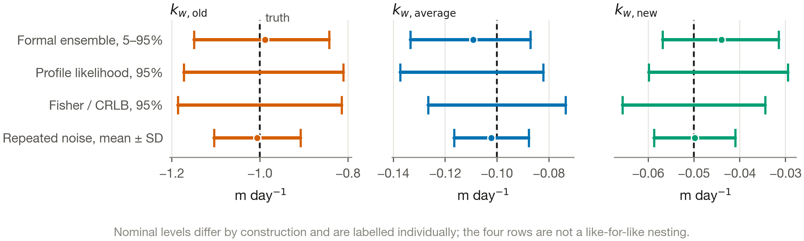

<!--
Single source of truth for the Research Paper. Build with ./build.sh
Every number here traces to Net3/baseline_cache/; nothing is carried over from
Ruixin_Peng_Draft_FINAL.docx, whose configuration (72 h horizon, 7x7x7 grid, informal GLUE
as the primary rule) is superseded.

STILL TO CONFIRM BEFORE SUBMISSION (values not derivable from the repository):
  - CID, programme, and first supervisor's name in the title block below. The submission
    filename is ResearchPaper-CID-YourName-SurnameofFirstSupervisor, so the supervisor's
    surname is needed for the file as well as the page.
  - The generative-AI statement below is written from the facts recorded in PAPER_PLAN.zh.md
    section 11. The departmental Policy Guidance note had not been obtained when it was
    drafted, so its FORMAT may need to change; the factual content should not.
    It and the Acknowledgements sit inside EXCLUDE markers, so build.sh strips both and
    paper.docx does NOT contain them. That is deliberate while the format is unsettled, but it
    means the declaration exists only in this source: it must be carried into the submitted
    Word file by hand. The word-count block prints both as held out, so a build that has lost
    them says so.
  - Title page must follow the course template and must not use the College crest.
  - The repository URL and release tag in Appendix I. Deliberately left as a placeholder: the
    Imperial-hosted repository is created and the release tagged only once the paper is final,
    so that the tag names the state the submitted paper actually describes. Insert it LAST,
    then rebuild, then check that Appendix I and Section 2.2.4 agree.
-->

**Programme:** MSc [PROGRAMME — to confirm], Department of Civil and Environmental Engineering,
Imperial College London

**CID:** [CID — to confirm]  **Supervisor:** [FIRST SUPERVISOR — to confirm]

**Module:** CIVE70058 Research Paper

# Abstract

Grouped wall-decay coefficients are routinely calibrated from a handful of chlorine monitors,
but the uncertainty reported can reflect the inference rule as much as the data, and whether
parameter error reaches prediction or operational decisions is seldom tested. This study
separates these effects in a controlled EPANET Net3 experiment with three synthetic reaction
zones, known coefficients and six monitors. A censored Gaussian likelihood is compared with the informal weighting previously applied to the
same system, on identical observations and candidate draws. Identifiability is triangulated
across prior contraction, displaced priors, Fisher information, profile likelihood and
repeated-noise calibration. Measurement, nuisance and structural errors are then placed on common
scales before propagation to prediction and low-chlorine risk.

Under known bulk decay and unbiased sensors, the formal rule contracted all three coefficients to
25–31% of their prior standard deviation, whereas the informal score at its original
0.120 mg L^-1^ behavioural threshold retained 86–98%. Both rules used the same 294 observations,
so the difference is produced by the weighting alone. Treating bulk decay and monitor offsets as
jointly unknown withdrew practical identifiability from the average and new coefficients.
Recalibration over 100 noise realisations gave spreads closely matching the Cramér–Rao bound, at
near-nominal 90% coverage. Systematic sensor error, bulk-decay misspecification and
length-structured heterogeneity displaced coefficients by as much as 5.94 baseline posterior
standard deviations, while the best achievable aggregate residual never exceeded the realised
observation-noise RMSE by more than 6.2%. Yet when the old or average zone was withheld its
coefficient returned to the prior midpoint and retained essentially the whole prior width, while
held-out prediction at the omitted monitors stayed close to the 0.1 mg L^-1^ observation-noise
scale. Displacements of several standard deviations largely preserved whole-network rank order,
but they altered the six-node operational shortlist under one risk metric and not another.

Parameter identification, predictive adequacy and decision stability therefore require separate
validation. All conclusions are bounded by a synthetic known-truth design with internal hold-out
evaluation and no field data.

# 1. Introduction

## 1.1 Chlorine residual modelling as an inverse problem

A chlorine residual is maintained through a distribution network to provide continuing
disinfection after treatment, and its concentration at any location reflects reaction in the
bulk water, reaction at the pipe wall, and the transport and residence time that determine
exposure to both [@Rossman1994; @Vasconcelos1997]. In the first-order representation implemented in EPANET, bulk decay is described by a coefficient
$k_b$ in day^-1^ and wall decay by $k_w$ in m day^-1^. The wall reaction is coupled to mass
transfer from the bulk, so diameter and flow regime also affect its effective contribution [@Rossman2000].

The two components are not equally accessible to measurement. Bulk decay can be estimated
independently from controlled bottle tests, whereas wall decay is less directly observable. It depends on pipe-surface condition, corrosion products, deposits and biofilm, and generally has to be inferred from pipe-loop or field concentration data after accounting for bulk decay
[@Hallam2002; @Powell2000]. Because networks contain far more pipes than monitors, wall
coefficients are commonly estimated for groups of pipes rather than individually, with grouping
based on whatever physical or spatial information is available [@Nejjari2014ChlorineCalibration;
@Munavalli2003SteadyState]. Those groups are usually fitted by global search, with genetic and
particle-swarm algorithms minimising concentration misfit [@PeiroviMinaee2019GAPSO;
@GomezCoronel2023GAChlorine], which returns a point estimate rather than a statement about how
well the data constrain it.

Chlorine calibration is therefore an inverse problem rather than a curve-fitting exercise, and
the distinction matters because the coefficients are not the only quantity of interest.
Calibrated models are also used to predict concentrations at unmonitored locations and to support
monitoring or control decisions, so a calibration may fail at several distinct levels, and those
failures need not occur together.

## 1.2 Uncertainty, identifiability and their propagation

Several uncertainty sources act on such a problem. Measurement noise and temporal dependence
reduce the effective information in monitored series, and readings at a reporting boundary are
censored rather than exact. Systematic offsets or drift bias the inferred parameters while remaining hard to diagnose from
fit quality, and online free-chlorine sensors degrade in exactly that way
[@Hutton2014Uncertainty; @Aisopou2024]. Bulk decay is often characterised separately and held fixed during wall-decay calibration, so an
error in it is absorbed by the wall coefficients, and grouping is an approximation where wall
reactivity varies between pipes [@Powell2000; @Hallam2002; @Nejjari2014ChlorineCalibration]. A close fit therefore does not establish that the inferred coefficients represent the underlying
reaction process.

Uncertainty here has been approached by assimilating observations in real time, updating states
and parameters together [@Hutton2014Uncertainty; @Rajakumar2019EnKF], by treating
input error explicitly in water-quality calibration [@Wu2022BEAR], and by formal Bayesian
inference on disinfectant decay parameters [@Jenks2025BayesianDisinfectant].

Identifiability analysis addresses how strongly the observations constrain those parameters.
Local sensitivity-based diagnostics examine whether nearby parameter changes produce
distinguishable changes in the monitored outputs, which Fisher information and the associated
Cramér–Rao bounds quantify under an assumed observation model [@Brun2001]. Practical
identifiability concerns whether the finite, noisy observations available constrain the
parameters sufficiently, for which profile likelihood is a direct diagnostic [@Raue2009], and
repeated sampling then tests whether the resulting intervals show the bias and coverage the
assumed model implies. No single diagnostic
suffices. A posterior mean close to the truth may simply reflect favourable prior placement, and
a narrow posterior may reflect a restrictive prior or a misspecified likelihood rather than
physical correctness.

Uncertainty surviving calibration must finally be propagated to whatever decision the model
supports, where stability is again not a single property and holding at one scale does not imply
holding at another.

## 1.3 Methodological gap

Three methodological questions motivate this study. First, conclusions about parameter
uncertainty can depend on the inference formulation itself. GLUE-type environmental analyses may combine behavioural thresholds with informal likelihood
measures whose statistical interpretation depends on their relationship to the assumed error
process [@BevenBinley1992]. Critiques have shown that a measure not representing the sampling
distribution of model errors need not deliver formally calibrated parameter or prediction
uncertainty [@MantovanTodini2006; @Stedinger2008]. The controlled setting here sidesteps that broader debate rather than resolving it. Because the
synthetic observation model is known, the informal weighting previously applied to this system
can be compared directly with the corresponding formal likelihood on identical observations and
candidate draws.

Second, an identifiability result obtained under a favourable baseline does not establish that
the same parameters remain recoverable once further uncertainty sources are admitted. These act
in different ways, so loss of precision has to be separated from displacement of the estimate and
both placed on a common scale.

Third, parameter identification, predictive adequacy and decision robustness answer different
questions. A held-out prediction error cannot establish that the parameter governing a physical
process has been identified, and a high whole-network rank correlation cannot establish that a
small hot-spot set is unchanged.

## 1.4 Aim, research questions and scope

This study investigates how inference formulation and measurement, nuisance and structural-error
assumptions affect the practical identifiability of grouped chlorine wall-decay coefficients,
and whether the resulting parameter errors propagate to spatial prediction and to operational
low-chlorine risk prioritisation. A synthetic experiment on the EPANET Net3 network is used so
that the true coefficients are known, individual error sources can be introduced under
controlled conditions, and every diagnostic can be evaluated against a known reference.

**RQ1.** Under the controlled baseline assumptions, how much information do six monitored
chlorine series contain about three grouped wall-decay coefficients, and how strongly does the
answer depend on the inference formulation?

**RQ2.** How robust is baseline parameter identification to random measurement error, temporal
correlation, systematic sensor error, bulk-decay misspecification, zero-floor censoring and
within-zone structural heterogeneity?

**RQ3.** Do errors in the inferred parameters necessarily degrade spatial prediction or
operational prioritisation, and how does the answer depend on the risk metric used?

The study makes four contributions. It compares a formal censored Gaussian likelihood with the
specific informal weighting previously applied to this system, on identical observations and
candidate draws. It triangulates identifiability across posterior contraction, displaced priors,
Fisher information, continuous profile likelihood and repeated-noise calibration. It separates
precision loss from parameter displacement across measurement, nuisance and structural
perturbations on common scales. And it distinguishes parameter identification, predictive
adequacy and decision robustness.

The scope is deliberately bounded. Network, zoning and truths are synthetic, the hydraulic model
is treated as known rather than calibrated, chemistry is first-order in both bulk and wall
reactions, and no field observations enter the analysis.

# 2. Method and approach

## 2.1 Study framework and controlled Net3 system

### 2.1.1 Network and hydraulic model

All experiments used the EPANET Net3 example network [@Rossman2020] through WNTR
[@Klise2017WNTR], comprising 92 junctions, 117
pipes, three tanks, two reservoirs and two pumps. Hydraulic and reporting timesteps were 1 h and
the water-quality timestep was 5 min. The hydraulic model was treated as known rather than
calibrated: demands, pipe roughness, tank characteristics and pump controls were held at the
values encoded in the frozen Net3 input file throughout, so the experiments below vary
water-quality parameters or the observation process while retaining the same hydraulic
representation.

### 2.1.2 Synthetic three-zone wall-decay representation

The pipes were divided into three synthetic spatial reaction zones by a deterministic rule on
node coordinates. Nodes with $y \le 10$ were assigned to the average zone; among the remainder,
those with $x \le 26$ were assigned to the new zone and those with $x > 26$ to the old zone. A
pipe whose end nodes fell in different zones was assigned to the weaker-reactivity side, under
the fixed ordering new, average, old. This produced 14 old-zone, 37 average-zone and 66 new-zone
pipes.

These labels denote synthetic reaction groups only. Net3 carries no pipe material or age
information used by this study, so "old", "average" and "new" should not be read as observed
asset-condition classes.

Both bulk and wall reactions were represented as first-order processes. The synthetic truth
assigned uniform wall-decay coefficients of −1.0, −0.1 and −0.05 m day^-1^ to the old, average
and new zones. The baseline bulk-decay coefficient was fixed at −0.5 day^-1^, except in the
robustness analyses of Section 2.5.5. Source chlorine was 1.0 mg L^-1^ and the tanks were
initialised at 0.5 mg L^-1^.

### 2.1.3 Monitoring configuration and priors

Six junctions were used as calibration monitors, two in each synthetic zone: nodes 107 and 113
in the new zone, 15 and 145 in the old, and 209 and 231 in the average. This configuration also
permits two distinct held-out designs to be separated: leave-one-monitor-out retains one local
monitor in the withheld monitor's zone, whereas leave-one-zone-out removes both.

The 48 h assessment window defined in Section 2.2.2 contains 49 hourly reporting points per
monitor, giving $6 \times 49 = 294$ observations in the baseline calibration. Independent
uniform priors were specified as [−1.5, −0.2], [−0.2, −0.04] and [−0.10, −0.005] m day^-1^ for
the old, average and new coefficients. All three contain their synthetic truths but are not
centred on them, which matters for interpreting any posterior that reverts towards its prior.
Table 1 summarises the baseline design.

{{TABLE1}}

Table 1. **Baseline design and parameter ranges.** Constants are held fixed across all experiments except where a later section states otherwise. Prior standard deviations are those of the uniform priors.

## 2.2 Forward simulation and synthetic observation generation

### 2.2.1 Forward chlorine simulation

The baseline synthetic truth was generated by running the EPANET water-quality model with the
true zonal wall-decay coefficients, the fixed bulk-decay coefficient and the boundary
concentrations of Section 2.1, storing concentrations at all 92 junctions including the six
calibration monitors. This simulation defines the reference chlorine field from which the
baseline observations are generated and against which baseline parameter and prediction recovery
are evaluated; the robustness experiments of Sections 2.5 and 2.6 perturb either this field or
its observation model explicitly.

### 2.2.2 Warm-up and assessment-window selection

Because storage makes the chlorine field settle slowly, warm-up was assessed by an explicit
cyclostationarity test rather than chosen by convention. Demands and pump operation are 24 h
periodic, so each cycle was compared with its successor against six diagnostics whose tolerances
were declared in advance, evaluated at the synthetic truth and at both corners of the prior box.

The rule required every diagnostic to pass, and no cycle pair satisfied it within the 168 h model
horizon. Because the inverse analyses depend directly on the chlorine field, 120 h was adopted
instead, the earliest warm-up at which all three chlorine-concentration diagnostics passed. The
assessment window is therefore 120–168 h, with 49 hourly reporting points per monitor.
Definitions, tolerances and per-cycle values are in Appendix A; what the unmet diagnostics bound
is reported in Section 3.1.2.

### 2.2.3 Synthetic measurement-error model

Synthetic observations were generated as

$$C_{\mathrm{obs}} = \max\left[0, C_{\mathrm{true}} + \epsilon\right],  \epsilon \sim N(0, \sigma^{2}),$$

with a baseline $\sigma = 0.1$ mg L^-1^. Throughout this study $\sigma$ denotes one standard
deviation of the assumed random measurement error, not a 95% interval or a hard error bound. The
non-negativity floor means a latent reading below zero is recorded as zero; such observations
are treated as left-censored in the primary likelihood rather than as exact zero measurements.

The reference observation set uses a fixed random seed. Repeated-noise experiments use
separately generated realisations, whereas paired perturbation studies reuse identical noise
seeds across comparison arms, so that a reported shift isolates the imposed perturbation rather
than a change in the random draw.

### 2.2.4 Numerical and unit verification

All concentrations are reported in mg L^-1^, converted to WNTR's internal kg m^-3^ representation
on model input and back on output [@Klise2017WNTR; @WNTRdocs].
The EPANET absolute quality tolerance was set to $1\times10^{-5}$ mg L^-1^. It is a chosen setting, a thousand times stricter than the EPANET default of 0.01 mg L^-1^
[@Rossman2020], holding the tolerance-to-source ratio fixed so that the corrected and superseded
implementations are the same numerical experiment.

Three checks support the implementation. A single-pipe bulk-only configuration was compared with
the analytic first-order solution $C = C_0\exp(k_b t_{\mathrm{res}})$. Wall-reaction behaviour
was checked for the expected sign, for monotonic response, and against the limiting case without
mass-transfer resistance. A unit-equivalence test confirmed that the
corrected implementation reproduces the previously generated field to within a maximum relative
difference of $2.3\times10^{-7}$, with no change in any of the below-threshold duration
classifications tested. Agreement at this level is expected rather than fortuitous. First-order
kinetics are invariant to the concentration scale, and every absolute quantity was rescaled
together, including the source and tank concentrations, the observation standard deviation, the
0.2 mg L^-1^ threshold and the tolerance-to-source ratio, so the two implementations are the same
numerical experiment. Any residual beyond solver tolerance would therefore have indicated a
second, independent error. The Net3 input file is frozen and hash-checked, and the computational environment is pinned to exact library versions, which matters here because the study documents version-specific WNTR behaviour. The analysis code, the cached artifacts and these checks are archived in the project repository at the release cited in Appendix I. Full results are given in Appendix B.

## 2.3 Parameter sampling and inference formulations

### 2.3.1 Priors and Sobol candidate library

The three-dimensional baseline prior box was sampled with $8192 = 2^{13}$ scrambled Sobol draws
[@Sobol1967; @Owen1998].
Each baseline candidate was simulated once and its predictions at all 92 junctions cached.
Experiments that changed only the observation realisation or the weighting rule reused this
common library. The censored Gaussian, iid Gaussian and informal GLUE formulations were evaluated
on identical prior draws and identical model predictions, so any difference between those
baseline results is attributable to the weighting formulation rather than to sampling or to
different forward simulations. Experiments that altered the prior domain or a forward-model parameter generated their own prediction libraries under the same sampling principles. These were the displaced-prior tests of Section 2.4.2, the bulk-decay cases of Section 2.5.5 and the scenarios of Section 2.8.4.

Sampling convergence of the baseline weighted ensemble was assessed on the nested leading Sobol
subsets of 1024, 2048, 4096 and 8192 candidates, comparing posterior medians, quantiles and
effective sample size. The effective sample size, $\mathrm{ESS} = 1/\sum_i w_i^2$, is reported
throughout as a diagnostic of how far the discrete weights concentrate.

### 2.3.2 Censored Gaussian likelihood

The primary inference rule was a censored Gaussian likelihood. Up to additive constants
independent of the parameter vector $\theta$,

$$\ell(\theta)=-\frac{1}{2}\sum_{y_i>0}\left[\frac{y_i-\mu_i(\theta)}{\sigma}\right]^{2}+\sum_{y_i=0}\log\Phi\left[-\frac{\mu_i(\theta)}{\sigma}\right],$$

where $y_i$ is an observed concentration, $\mu_i(\theta)$ the corresponding model prediction and
$\Phi$ the standard-normal cumulative distribution function. Positive observations contribute
Gaussian residual terms; observations recorded at the zero floor contribute the probability that
the latent reading lies at or below that floor.

The rule uses the uniform priors of Section 2.1.3 and has no behavioural acceptance threshold.
Because candidates are drawn directly from those priors, their normalised likelihood weights are
a discrete Monte Carlo approximation to the posterior over the sampled space. Weights were
computed in numerically stable form as

$$w_i=\frac{\exp\left[\ell(\theta_i)-\ell_{\max}\right]}{\sum_j \exp\left[\ell(\theta_j)-\ell_{\max}\right]},$$

from which weighted means, standard deviations, quantiles and effective sample sizes follow.

### 2.3.3 Formal iid Gaussian comparator

A formal iid comparator used the same prior draws, the same observation-error standard deviation
and the same Gaussian residual model, but treated every recorded value as exact, including those
at the zero floor. It therefore differs from the primary rule only in its handling of censored
readings, and exists solely to quantify what that handling contributes; it is not a second
primary analysis.

### 2.3.4 Informal GLUE behavioural comparator

The specific informal GLUE weighting [@BevenBinley1992] used in the original analysis of this
system was retained as a comparator, so that its effect could be measured on the same observations and predictions
as the formal rules. Candidate $i$ received weight

$$w_i^{\mathrm{GLUE}} \propto \exp\left[-\frac{1}{2}\left(\frac{\mathrm{RMSE}_i}{\sigma}\right)^{2}\right]\mathbf{1}\left(\mathrm{RMSE}_i < T\right),$$

with $T$ a behavioural RMSE threshold. Three thresholds were examined: 0.107, 0.110 and 0.120 mg
L^-1^. The first is the approximate one-sided 95% upper acceptance band of the RMSE objective
evaluated at the truth,

$$T(\sigma)=\sigma\left(1+\frac{z}{\sqrt{2N}}\right),$$

which for $z = 1.645$, $N = 294$ and $\sigma = 0.1$ mg L^-1^ gives 0.1068 mg L^-1^. This is a
statement about the sampling distribution of the objective at the truth, not a credible interval
for the parameters. The 0.120 mg L^-1^ threshold reproduces the original analysis and 0.110
provides an intermediate case. Threshold sensitivity is a property of this comparator alone;
neither formal rule uses an acceptance threshold.

## 2.4 Identifiability analysis

### 2.4.1 Prior contraction

Posterior contraction was summarised by the retained-standard-deviation ratio $R_{\mathrm{SD},j}
= \sigma_{\mathrm{post},j}/\sigma_{\mathrm{prior},j}$, reported throughout as *SD retained*. A
value near one indicates little reduction in prior dispersion; smaller values indicate stronger
contraction. Posterior means are reported alongside it because contraction and truth recovery
are distinct: a mean close to the synthetic truth is weak evidence when the prior is already
favourably placed, and a narrow posterior can still be displaced under model or observation
error. SD retention is therefore treated as a contraction diagnostic, not as a sufficient
identifiability test on its own, which is why the four further analyses below are needed.

### 2.4.2 Displaced-prior tests

To separate information supplied by the observations from favourable prior placement, the
calibration was repeated over 30 independent noise realisations using displaced prior boxes of
unchanged width. In the DOWN design each box retained its original width but was re-centred at the known synthetic truth minus one original-prior standard deviation, so the displacement is defined relative to the truth rather than to the original midpoint. In the OLDUP design only the old-zone box changed direction, being centred at the truth plus one
original-prior standard deviation, while the average and new boxes kept their DOWN positions.
OLDUP is therefore a directional check for the old coefficient rather than a second like-for-like
three-parameter test. An upper cap of −0.005 m day^-1^, imposed to keep the old prior in the non-positive decay domain, then shifted that box down to a realised midpoint of −0.655 m day^-1^, about 0.92 original-prior standard deviations from the truth rather than the intended one.

Recovery was measured as the fraction of the imposed displacement closed,

$$G_j=\frac{\mu_{\mathrm{post},j}-m_{\mathrm{disp},j}}{k_{\mathrm{true},j}-m_{\mathrm{disp},j}},$$

where $m_{\mathrm{disp},j}$ is the displaced midpoint. $G_j = 0$ means the estimate stays at
that midpoint, $G_j = 1$ means full recovery to the truth, and values above one mean movement
beyond it.

### 2.4.3 Fisher information and Cramér–Rao bounds

Local identifiability was assessed from the sensitivity Jacobian of the 294 monitored values
[@Brun2001].
For independent homoscedastic Gaussian errors,

$$\mathbf{F}=\frac{1}{\sigma^{2}}\mathbf{J}^{\mathsf{T}}\mathbf{J},  J_{ij}=\frac{\partial C_i}{\partial\theta_j}.$$

evaluated at the synthetic truth by finite differences. The calculation assumes errors at $\sigma
= 0.1$ mg L^-1^ and does **not** include the censoring correction, so it is a local information
benchmark rather than a duplicate of the primary likelihood.

Three nested parameterisations were examined: (A) the three wall-decay coefficients alone; (B)
those plus bulk decay; and (C) those plus bulk decay and six monitor-specific offsets, each
constant across that monitor's 49 observations. In B and C the nuisance parameters were
marginalised and the marginal Cramér–Rao standard deviations normalised by the corresponding
prior standard deviation, a ratio below one being the criterion for local practical
identifiability adopted here. This is a benchmark relative to the chosen prior scale, not a
universal threshold. Marginalisation and the step-size check are in Appendix D.

### 2.4.4 Continuous profile likelihood

Likelihood geometry was assessed by continuous single-parameter profiles [@Raue2009]: each wall coefficient
was fixed in turn while the other two were re-optimised by Nelder–Mead within their prior
bounds, and the endpoints of the 95% interval were located by Brent bisection at

$$\Delta\mathrm{NLL}\le\tfrac{1}{2}\chi^{2}_{1,0.95}\approx 1.92 .$$

Profiles were computed under the primary censored likelihood, with an iid Gaussian profile
retained as a censoring benchmark. A 21-point-per-parameter grid was kept for visualisation
only, because a discrete grid can place interval endpoints only at its nodes.

### 2.4.5 Repeated-noise calibration

Repeated-sampling behaviour was assessed by recalibrating for 100 independent observation-noise
realisations. For each coefficient the analysis recorded the bias of the posterior mean, the
empirical standard deviation of that mean across realisations, its ratio to the Case-A
Cramér–Rao bound, and the mean posterior standard deviation reported *within* individual realisations. The last of these asks whether the uncertainty a single calibration claims matches the estimator's actual sampling spread. Empirical coverage was evaluated for nominal 90%
and 95% weighted posterior-quantile intervals, with normal-approximation intervals as a
secondary check.

The observation-error draws are independent, but all 100 calibrations are evaluated against the
same 8192-member Sobol prediction library, so their finite-library Monte Carlo errors are
correlated; the effective-sample-size distribution is reported as a numerical-resolution
diagnostic.

## 2.5 Robustness to measurement and nuisance errors

Two kinds of effect are distinguished throughout, and reported on different scales. *Widening*
is the loss of precision when an uncertainty source is represented in the inference;
*displacement* is the movement of an estimate when a perturbation is imposed but not
represented. For coefficient $j$ the standardised displacement is

$$Z_{\Delta,j}=\frac{\operatorname{median}_r\left(\mu_{j,r}^{\mathrm{pert}}\right)-\operatorname{median}_r\left(\mu_{j,r}^{\mathrm{ref}}\right)}{\operatorname{median}_r\left(\sigma_{j,r}^{\mathrm{ref}}\right)},$$

where the reference is the set of 30 unbiased realisations at $\sigma = 0.1$ mg L^-1^. The
denominator is thus the median *within-realisation* posterior standard deviation under the
repeated unbiased baseline, not the single-realisation value of Section 3.2.

### 2.5.1 Random measurement error

Sensitivity was evaluated at $\sigma = 0.02$, 0.05, 0.10 and 0.15 mg L^-1^ with 30 independently
generated noise realisations at each level. The same $\sigma$ was used both to generate the
observations and in the corresponding likelihood, and the informal comparator used the
$\sigma$-dependent threshold of Section 2.3.4.

Effective sample size distinguishes inferential change from inadequate numerical resolution. A row was flagged as sampling-limited when its median ESS fell below 100, or when any realisation
produced an empty behavioural set. Contraction from such rows is not read as a quantitative
estimate of the benefit of that sensor precision, because a sharper likelihood concentrates on a
library drawn for the baseline noise level.

### 2.5.2 Temporal autocorrelation

Temporal dependence was treated as an assumed covariance sensitivity rather than an estimated
property, since the baseline observations are generated independently. Each monitor's 49 hourly
residuals were assigned a first-order autoregressive covariance $\Sigma_m(t,s) =
\sigma^2\rho^{|t-s|}$, with the six monitor blocks mutually independent, and the Fisher
information recomputed as $\mathbf{F}_{\mathrm{AR1}} =
\mathbf{J}^{\mathsf{T}}\mathbf{\Sigma}^{-1}\mathbf{J}$ rather than by a scalar
effective-sample-size correction. The principal case used $\rho = 0.4$, with a sweep over $\rho
= 0$, 0.2, 0.4, 0.6 and 0.8 reported in Appendix D.

### 2.5.3 Sensor bias and drift

Systematic error was added to the synthetic measurement before the non-negativity floor,
$C_{\mathrm{obs}} = \max\left[0, C_{\mathrm{true}} + \epsilon + b\right]$, so that a negative
offset pushes more readings onto the floor than a positive one of the same size. Offsets were
applied at each of the six monitors, giving 24 bias arms of 30 noise realisations each; only the
observations are perturbed, so candidate predictions are unchanged.

Drift was examined at monitors 15 and 231 as a linear ramp $b(t) = D (t-t_0)/48$ over the
window, correct at the start and off by $D$ at the end, paired under identical noise with
constant-offset controls at its mean and endpoint values. This separates the drift's temporal
shape from its mean magnitude. Offsets, arm definitions and per-arm results are in Appendix F.

### 2.5.4 Zero-floor censoring

The primary censored likelihood and the formal iid exact-zero comparator were applied to the
same synthetic observation sets over 30 noise realisations, so that only the statistical
treatment of readings recorded at zero changed while the observations and predictions stayed
identical. The number of floored readings and the resulting risk ranking were recorded alongside
the coefficient difference.

### 2.5.5 Bulk-decay misspecification

Observations were generated at the true $k_b = -0.5$ day^-1^ and the wall coefficients
recalibrated with $k_b$ fixed at −0.4 and −0.6 day^-1^, that is ±20% misspecification, over the
same 30 noise realisations. Besides parameter displacement, the resulting risk fields were
compared under both the duration-based $\bar{P} = E[D]/48$ and the cumulative-deficit $E[A]$
rankings defined in Section 2.8.1.

## 2.6 Structural heterogeneity experiments

Headline structural effects use the primary censored likelihood; the length-structured
experiment was additionally run with the informal GLUE comparator, to test whether the inference
formulation alters the apparent response to structural misspecification.

### 2.6.1 Symmetric within-zone heterogeneity

Unstructured heterogeneity was generated as $k_{w,p} = \bar{k}_{w,z}(1+\delta_p)$ with $\delta_p
\sim U(-J, J)$ and $J = 0$, 0.20, 0.35 or 0.50. The perturbation distribution is symmetric about
the nominal zone coefficient, but a finite random field need not have exactly zero sample mean,
so coefficient error is evaluated against each realised field's own arithmetic zone mean rather
than the nominal value.

The zero-jitter arm is a homogeneous paired control. The same underlying random variates and the
same noise realisation were reused across the magnitude sweep, so differences between arms
reflect heterogeneity magnitude rather than a different spatial arrangement or noise draw.
Because one spatial realisation cannot establish a systematic effect, the $J = 0.20$ case was
repeated over 25 independently generated pipe-level fields with the noise realisation held
fixed, so that the resulting between-field scatter isolates sensitivity to the arrangement
itself.

### 2.6.2 Length-structured within-zone heterogeneity

The second experiment introduced deterministic structure while keeping the same three zones.
Within each zone, pipes were ranked by length and given a centred rank score $s_p \in [-1, 1]$
rising from the shortest to the longest pipe and having zero mean, and the pipe coefficient was
set to

$$k_{w,p}=\bar{k}_{w,z}\left(1+\lambda s_p\right).$$

Since $\bar{k}_{w,z} < 0$, a larger $s_p$ makes the coefficient more negative, so longer pipes
decay more strongly. The zero mean of $s_p$ holds each zone's arithmetic coefficient exactly at
$\bar{k}_{w,z}$ while its length-weighted mean shifts towards stronger decay, which is what
makes the two candidate targets distinguishable.

The length-structure amplitude was varied over $\lambda = 0$, 0.25, 0.50 and 0.75. **$\lambda$
is a modulation amplitude, not a Pearson or Spearman correlation coefficient**: the length
ranking and the coefficient ranking are perfectly monotone for any $\lambda > 0$, and $\lambda$
sets only how far the coefficients spread about the zone mean. At $\lambda = 0$ the truth is
homogeneous and the two target means coincide. Each non-zero amplitude used 30 independent noise
realisations. Only the truth is heterogeneous; calibration retains the three-zone homogeneous
model with one fitted coefficient per zone.

### 2.6.3 Structural-effect metrics

Structural effects were summarised by the four quantities Table 2 defines, because they answer
different questions. Raw bias measures the fitted coefficient against the realised arithmetic zone
mean. The paired structural increment removes the offset the same rule produces on a homogeneous
truth under the same noise, and the standardised displacement puts that paired shift on the scale
of Section 2.5 using the repeated-baseline denominator. The displacement fraction locates the fit
between the arithmetic and length-weighted references, reported **raw rather than
control-adjusted**. Full definitions and per-design results are in Appendix E.

## 2.7 Internal prediction validation

Four complementary validation designs were used to separate predictive performance from
parameter identification. Leave-one-monitor-out withheld each of the six monitors in turn while
retaining the second monitor of that zone; leave-one-zone-out withheld both monitors of a zone,
removing all direct observation of it. Both were repeated over 30 independent noise
realisations.

The two designs predict a *noisy* held-out observation, so their 90% predictive intervals
combine ensemble and observation variance,
$\hat{C}\pm1.645\sqrt{\operatorname{Var}_w[C]+\sigma^2}$. They report held-out RMSE and
empirical coverage; leave-one-zone-out additionally reports the withheld zone's coefficient
error and SD retained.

A separate spatial validation calibrated on all six monitors and predicted at 20 junctions that
never entered any calibration, scored against the *noise-free* truth and summarised by coverage and by the normalised mean absolute error, $\mathrm{NMAE}=\sum_t|\hat{C}_t-C_t| \big/ \sum_t|C_t|$, evaluated per junction over the assessment window. This normalises by the mean of the truth rather than averaging pointwise ratios, which would be unstable where the true concentration approaches zero. Its bands therefore carry ensemble parameter uncertainty only, without the $\sigma^2$ term. Finally, leave-one-zone-out was repeated under ±20%
within-zone heterogeneity across eight independently generated fields, each with its own noise
draw, with coefficient error measured against that field's own arithmetic zone mean.

## 2.8 Operational risk assessment

### 2.8.1 Low-chlorine metrics

The likelihood-weighted ensemble was propagated to all 92 junctions and evaluated against
$C_{\mathrm{crit}} = 0.2$ mg L^-1^, a representative operational threshold adopted for this
study rather than a regulatory limit. Five member-level quantities and their weighted summaries
are defined in Table 2. They are kept distinct because a window-breach probability, a
time-averaged breach probability, an expected duration, a cumulative deficit and a window
minimum describe different aspects of low-chlorine behaviour: the first records only whether a
threshold was crossed, whereas the deficit combines how long and how far. Duration and deficit
were integrated by trapezoid over the 48 one-hour intervals, and the per-member minimum was
summarised by weighted means and quantiles rather than reported as a single deterministic value.
The weights propagated here are those of the baseline calibration, which was conditioned on one
reference observation realisation. Every risk figure quoted below is therefore conditional on
that realisation and is not a median over the 30 noise realisations used for the inference
diagnostics; observation-noise variability enters the risk results only through the perturbation
comparisons of Section 3.6.2.

### 2.8.2 Water age and demand weighting

Water age was computed over the same window as a reaction-independent diagnostic, and its spatial
association with expected duration and cumulative deficit described by Spearman rank correlation.
The 92 junctions are not independent samples, so no junction-level p-value is reported; for the duration association a descriptive
width was obtained by resampling whole spatial blocks, with the design in Appendix G. Network
summaries were reported over all 92 junctions, over the 59 with non-zero demand, and
demand-weighted, because the three answer different questions.

### 2.8.3 Ranking robustness

Robustness was assessed at two scales that are not interchangeable. The primary network-scale
statistic is the Spearman rank correlation between perturbed and reference risk fields across
all 92 junctions; the primary shortlist statistic is the top-six Jaccard index (Table 2), six
being the common headline size. Kendall correlation and alternative shortlist sizes were
retained as supplementary diagnostics where computed. For perturbations repeated over noise
realisations, nodewise risk values were first reduced to their median across realisations and
the ranking statistics computed from that median field. Both statistics were evaluated
separately under the duration-based and deficit-based metrics, since the two need not identify
the same leading junctions.

### 2.8.4 Temperature, ageing and dosing scenarios

The ensemble was propagated through four scenarios using Arrhenius temperature scaling for
chlorine decay [@Hua1999; @Powell2000; @Vasconcelos1997],

$$k(T)=k(T_{\mathrm{ref}})\exp\left[-\frac{E_a}{R}\left(\frac{1}{T_K}-\frac{1}{T_{\mathrm{ref},K}}\right)\right],$$

with $T_{\mathrm{ref}} = 12$ °C. The activation-energy distributions and the temperature
perturbation are illustrative settings prescribed here rather than measured values. Draws were
truncated to keep simulated temperatures inside the pre-defined 8–24 °C range, and the
distributions are in Appendix G. The scenarios were: (A) 12 °C
baseline; (B) 16 °C; (C) 20 °C heatwave; and (D) 20 °C with illustrative ageing multipliers of
1.00, 1.35 and 1.85 for the new, average and old zones.

Draws were reused across scenarios, so pairwise differences are not contaminated by Monte Carlo
variation. Only candidates whose weight was at least $10^{-6}$ of the **maximum** weight were
propagated, a numerical truncation rather than an acceptance threshold. Corrective dosing was
evaluated under Scenario C, the heatwave *without* ageing, raising reservoir source chlorine from
1.00 to 1.15 and 1.30 mg L^-1^ with tank initial chlorine scaled by the same factor.

{{DEFTABLE}}

Table 2. **Symbols and metric definitions.** Integrals run over the 120–168 h assessment window and $w_i$ are the normalised likelihood weights of Section 2.3.2.

# 3. Results and discussion

## 3.1 Forward-model baseline and synthetic observations

### 3.1.1 Baseline chlorine dynamics across the monitored network

The baseline inverse problem is anchored to a single reference forward field, described here;
Sections 3.3 and 3.4 perturb that field or its observation model explicitly. Under the imposed
truth, concentrations across the assessment window follow the 24 h demand and pump cycle with a
network-wide median of 0.761 mg L^-1^ and a 5th-to-95th percentile range of 0.168 to 0.956 mg
L^-1^ (Figure 1B, C).

The six monitors sample most of that range rather than replicating one another. Mean window
concentrations are 0.845 and 0.827 mg L^-1^ at nodes 107 and 113 in the new zone, 0.717 and
0.374 at nodes 209 and 231 in the average zone, and 0.251 and 0.355 at nodes 15 and 145 in the
old zone. The broad zonal pattern follows the imposed reactivity contrast, but the coefficient does not
set the level on its own. The two average-zone monitors differ by nearly a factor of two, and node 231 clears the highest
old-zone monitor by only 0.019 mg L^-1^, because residence time and network position also
modulate the accumulated decay. In the deterministic noise-free reference trajectory, 21 of the 92 junctions cross below the
0.2 mg L^-1^ threshold at least once in the window. That is a property of the truth, not the
ensemble-weighted breach count of Section 3.6.

### 3.1.2 Warm-up and assessment-window adequacy

The three concentration criteria, at the monitors, in the network 95th percentile and in the
tanks, were all first satisfied at 120 h, which is why the assessment window begins there.

Two criteria were never satisfied inside the model horizon. The 95th-percentile water age was
still changing by 12.8 h between the last two available cycles, and the network-mean cumulative
deficit by as much as 5.1%. The hotspot pattern moves with it. Over the same comparison the
top-10 cumulative-deficit sets at the truth had a Jaccard overlap of 0.818, one node in ten
differing. The horizon could not be extended without modifying the model (Appendix A). Parameter
inference is therefore supported by a concentration-stable window, whereas absolute water ages,
absolute risk severities and some hotspot boundaries in Section 3.6 retain a residual dependence
on the horizon and are used for comparison between conditions rather than as calibrated
magnitudes.

### 3.1.3 Signal and noise characteristics of the synthetic observations

Observations were formed by adding Gaussian noise with a standard deviation of 0.1 mg L^-1^ to
the true series at the six monitors and flooring the result at zero, giving 6 x 49 = 294
residuals. The realised noise RMSE over the window was 0.0973 mg L^-1^, while the minimum RMSE
anywhere in the 8192-member candidate library was 0.0971 mg L^-1^: the best candidate therefore
fits the observations to approximately the imposed noise floor. This establishes that a low
aggregate residual is attainable, not that the corresponding parameter vector is correctly
identified. Small residual differences accumulated over 294 observations may still carry
substantial inferential information, and Section 3.2 measures how much of it the competing
weighting rules extract.

The same absolute error represents very different relative perturbations across the network: at
node 107 a standard deviation of 0.1 mg L^-1^ is about 12% of the mean concentration, against
roughly 40% at node 15. The low-concentration old-zone monitors therefore operate at a poorer
concentration-scale signal-to-noise ratio, although parameter information ultimately depends on
the concentration Jacobian rather than relative concentration alone (Section 3.2.3). In the
reference realisation, ten of the 294 observations were floored at zero. Six of these were at node 15, three at node 145 and one at node 231, that is nine in the old zone and one in the average zone, none
in the new zone. Censoring is thus concentrated in the part of the network most relevant to the threshold-based
risk analysis that follows, and is handled explicitly in the primary likelihood.

## 3.2 Inference formulation determines apparent identifiability

### 3.2.1 The same observations under three weighting rules

How much of any answer about parameter information is a property of the weighting rule rather
than of the data? All three rules were applied to one library of 8192 candidates, so
observations, prior and candidate set were identical and only the weighting changed.

The three rules disagree sharply (Table 3, Figure 2). Under the primary censored Gaussian
likelihood the posterior standard deviation was 25.0%, 30.7% and 28.3% of the prior standard
deviation for the old, average and new coefficients respectively. Under the informal GLUE score at the threshold used in the original analysis, RMSE < 0.120 mg
L^-1^, the same 294 residuals left 85.8%, 98.4% and 98.0% of the prior standard deviation intact.
The average and new behavioural distributions retained essentially the full prior dispersion and
were effectively prior-dominated under this rule. The formal iid comparator, which differs from the primary rule
only in treating a floored reading as an exact zero, returned 24.5%, 30.6% and 28.3%; the
treatment of the ten floored observations therefore cannot explain the formal–informal
difference in this experiment.

{{TABLE3}}

Table 3. **Baseline inference comparison.** Three weighting rules on the same 294 residuals and 8192 Sobol candidates, the informal score at both thresholds, for the reference noise realisation. SD retained is the weighted-ensemble standard deviation as a percentage of the prior; it is a posterior standard deviation only under the two formal rules, since the informal score is not a likelihood.

The weights show why, and the reason is arithmetic. The formal weights concentrate on an effective sample of about 157 of 8192 draws (1.9%). The
informal effective sample size almost equalled the number of retained candidates, at 4783 of 4786
for a threshold of 0.107 and 7062 of 7084 at 0.120, so its weights were nearly uniform within the
accepted set. For an iid
Gaussian residual model the informal log-weight is the Gaussian log-likelihood divided by $N$,
up to a constant. Equivalently it weights residuals as though the standard deviation were
$\sigma\sqrt{N} = 1.71$ mg L^-1^ at $N = 294$. That is seventeen times the assumed sensor noise,
and above the 1.0 mg L^-1^ source concentration.

This is consistent with published criticisms of informal likelihood measures, which do not
accumulate information at the rate implied by the number of observations, so their distributions
describe the analyst's acceptance rule as much as the evidence [@MantovanTodini2006;
@Stedinger2008]. The point here is narrower than the general debate over generalised likelihood
uncertainty estimation [@BevenBinley1992; @BevenBinley2014]: it concerns the specific
pseudo-likelihood implemented in the original analysis, not the behavioural philosophy. Because
the two families differ by the weighting alone, the wide informal distributions cannot be read
as evidence that six monitors are uninformative about three grouped coefficients. Whether the
formal contraction is itself trustworthy is a separate question, taken up next.

### 3.2.2 Thresholds cannot substitute for the omitted information factor

Tightening the informal cut-off from 0.120 to 0.107 mg L^-1^ reduced the behavioural set from
7084 to 4786 candidates, yet the retained prior standard deviations fell only to 71.1%, 91.8%
and 88.2%, still two to three times the formal values. Candidate rejection therefore cannot
restore the information factor $N$ the score omits.

To exclude favourable prior placement as the cause of the formal contraction, all three prior
boxes were re-centred at the truth minus one original-prior standard deviation, keeping their
original width, and the calibration repeated over 30 noise realisations. The formal likelihood
recovered 88%, 95% and 96% of the imposed displacement for old, average and new while retaining
27.1%, 28.9% and 28.4% of the displaced prior's standard deviation, matching the baseline
contraction from a prior no longer centred on the truth. The informal comparator recovered
substantially less at both thresholds.

The OLDUP check reversed the old-zone displacement alone. Because the non-positivity constraint
shifted its realised midpoint to −0.655 m day^-1^, the upward displacement is about 0.92
original-prior standard deviations rather than a full one. Formal recovery for old was 88%
downward and 112% upward, symmetric within the noise, whereas informal recovery moved strongly
with the direction of displacement. The pronounced identifiability gradient reported in the
original analysis, in which old appears far better constrained than average or new, is therefore
a property of the weighting rule rather than a ranking of what the monitoring array can resolve.
Full threshold and displacement matrices are given in Appendix C.

### 3.2.3 Three further diagnostics agree with the baseline result

Prior contraction under a single likelihood and a single noise realisation is weak evidence on
its own, so the baseline was checked against three diagnostics that fail in different ways
(Figure 3). The Cramér–Rao bound computed from the Fisher information for the three wall-decay
coefficients alone gives standard deviations of 0.095, 0.014 and 0.008 m day^-1^, equivalent to
25.2%, 29.2% and 29.0% of the prior standard deviation and matching the ensemble result to
within about 1.5 percentage points. Continuous profile likelihood intervals at the 95% level are [-1.172, -0.811], [-0.137, -0.082]
and [-0.060, -0.029] m day^-1^, each covering its true value. Endpoints obtained by bisection are
quoted rather than grid endpoints, which understate the half-width by 39.0%, 14.9% and 28.1% and
are used here only for visualisation. Finally, repeating the calibration over 100 independent noise realisations gave a mean bias of at
most 0.15 times the empirical sampling standard deviation. The ratio of empirical spread to the
Cramér–Rao bound of 1.04, 1.06 and 1.12, and 90% interval coverage of 0.89, 0.88 and 0.85, are
close to nominal, with the new coefficient slightly under-covered.

Their agreement is convergent evidence of practical identifiability under the controlled
baseline, and each would fail differently were that result an artefact, being insensitive
respectively to the sampling design, the prior, and the realisation that produced the baseline
[@Brun2001; @Raue2009].

The conditions are strong: bulk decay fixed at its true value, sensors unbiased, errors
independent and Gaussian with known standard deviation, and the three-zone grouping correctly
specified. Two numerical caveats apply. The likelihood-weighted Sobol ensemble has an effective
sample size of about 157, limiting the Monte Carlo resolution of its weighted moments and
quantiles; the profile intervals are obtained independently of that library, but all 100
repeated-noise realisations reuse it, so their Monte Carlo errors are correlated.

## 3.3 Practical identifiability under measurement and nuisance errors

### 3.3.1 Random measurement error and temporal autocorrelation

Section 3.2 established what the six monitors resolve when every assumption holds; this section
relaxes them one at a time. Figure 4 collects the comparison on two scales: widening for the two
sources that only inflate uncertainty, displacement in baseline posterior standard deviations
for the six that move the estimate.

A 50% rise in the assumed measurement error, from 0.10 to 0.15 mg L^-1^, degraded
identifiability less than the original analysis implied: it widened the posterior by 1.41, 1.52
and 1.48 times, leaving 38.1%, 44.9% and 43.1% of the prior standard deviation. The claim that a
precision of 0.05 mg L^-1^ was required therefore reflects the informal score's inefficiency
rather than a demonstrated sensor specification. At 0.10 mg L^-1^ it returned standard deviations 2.4 to 3.1 times the formal ones. The converse benefit cannot be quantified here: at
0.05 and 0.02 mg L^-1^ the sharper likelihood concentrates on a library not drawn for it, the
median effective sample size falls to 21 and 2 draws, and those rows are reported as
sampling-limited.

Temporal correlation is an assumed sensitivity, not an estimated property, since the
observations are independent by construction. The usual scalar approximation would put the effective sample size at about 126 of 294 at a
correlation of 0.4. Recomputing the Fisher information from the full block covariance instead
widened the three bounds by 1.48, 1.49 and 1.44 times, to 37.5%, 43.5% and 41.7% of the prior
standard deviation. Correlation at this
strength inflates uncertainty without removing information. The field-relevant case is the
converse. Modelling correlation that is present widens the intervals, whereas fitting an
independent-error likelihood to observations that are genuinely correlated would narrow them,
reporting a precision the data do not support.

### 3.3.2 Systematic sensor error produces large coefficient displacement

Systematic error behaves differently. Constant offsets of +0.05 and +0.10 mg L^-1^ at node 15
alone moved the old-zone estimate by 2.19 and 3.87 baseline posterior standard deviations: with
no sensor-offset parameter in the calibration, instrument error is absorbed into the wall
coefficients rather than represented. The response is asymmetric in sign, because a downward bias pushes more readings onto the censoring floor. The same offsets applied negatively gave 2.59 and 3.82.

Sweeping the offset across all six monitors, 24 arms, shows the damage depends on where the
biased sensor sits. The largest displacement for any coefficient in any arm was 3.87 standard
deviations for old (node 15, +0.10 mg L^-1^), 5.94 for average (node 231, −0.10) and 4.44 for new
(node 113, −0.10). Contamination crosses zone boundaries. A −0.10 offset at new-zone node 107 displaced the average coefficient by 1.59. Per-arm results are in Appendix F.

Drift is governed by its mean, not its endpoint. A ramp reaching a given offset by the end of the window displaced the estimate by 0.89 to 0.99
times a constant offset at half that value, but only 0.45 to 0.64 times one at the endpoint
value. A sensor drifting to +0.10 mg L^-1^ therefore behaves much more like a constant +0.05 than
a constant +0.10. By comparison the censored
readings are a small correction. Across 30 independent noise realisations, treating them as
exact zeros rather than as left-censored moves the old coefficient by a median of 0.11 baseline
posterior standard deviations and the other two by less than 0.01, leaving the top-three risk
ranking unchanged. The count of ten floored readings quoted in Section 3.1.3 censuses the
reference realisation; the displacement is a median over the thirty.

### 3.3.3 Bulk and wall decay compensate for one another

Fixing bulk decay at a wrong value transfers the error into the wall coefficients. Refitting
with bulk decay 20% weaker or stronger than the truth, while the observations remain generated
at the true value, displaced the average and new coefficients by 1.41 to 1.58 baseline posterior
standard deviations and the old coefficient by only 0.56 to 0.66. The informal comparator
understated these displacements by factors of 3.8 to 5.5, so that formulation would materially
understate the apparent sensitivity to bulk-decay misspecification.

The Fisher analysis explains the pattern and extends it. Admitting bulk decay as a fourth
unknown raises the Cramér–Rao bound from 25%, 29% and 29% of the prior standard deviation to
30%, 54% and 54%: the old bound widens by a factor of 1.2, whereas the average and new bounds
widen by 1.8 and 1.9. Admitting six
monitor-specific offsets as further nuisance parameters raises the ratios to 67%, 224% and 109%,
so their local bounds equal or exceed the prior standard deviation. Under the identifiability
criterion adopted here, the average and new coefficients are therefore not practically
identifiable from this six-monitor design once both bulk decay and monitor offsets are treated as unknown. This is a statement about this observation design and nuisance model, not a mathematical impossibility. This is the formal counterpart of Section 3.3.2: the available concentration
sensitivities do not separate the weakly decaying zones' wall coefficients from bulk decay and
monitor-specific offsets under a six-monitor design.

None of these perturbations is visible in the aggregate residual: the best fit reachable anywhere in the candidate library stays within a few percent of the realised observation-noise RMSE in every case, as the Best fit column of Table 4 records. These displacements are large in parameter terms, but Section 3.6 shows that they do not translate into proportionate changes in the network-wide risk pattern, and that whether an operational shortlist changes at all depends on which risk metric defines it. Before that,
Section 3.4 turns to the one error source that is internal to the model rather than to the
instruments.

{{TABLE4}}

Table 4. **Robustness summary across error sources.** Standardisation follows Figure 4. The notes below the table define the entry types.

## 3.4 Structural heterogeneity and grouped effective parameters

### 3.4.1 Symmetric within-zone heterogeneity leaves no resolvable bias

Sections 3.2 and 3.3 treated each synthetic zone as internally homogeneous, whereas field wall
reactivity varies with pipe condition [@Hallam2002] and is unlikely to be uniform within any
practical grouping. Whether that variation
biases the grouped estimate turns out to depend on whether it has directional structure.

With per-pipe coefficients jittered symmetrically about each zone mean, the grouped estimate
stayed at the zone arithmetic mean to within the scatter between realisations. Across 25
independent fields at ±20%, the structural increment, defined as the shift relative to a homogeneous control run with the same noise, was +0.011 ± 0.033 m day^-1^ for old, +0.0002 ± 0.005 for
average and −0.0005 ± 0.002 for new. Each mean increment is a fraction of the field-to-field
standard deviation (0.32, 0.04 and 0.24), so no systematic bias is distinguishable from the
scatter; standardised as in Figure 4 they are +0.11, +0.02 and −0.06.

Fit quality gives no warning: the grid-based residual rises from its homogeneous resolution
floor of 0.0055 mg L^-1^ to 0.0068, leaving only 0.0013 attributable to the imposed
heterogeneity, and the best achievable fit stays at the noise floor. Nor would one field have sufficed. The realisation examined first gave an old-zone increment of −0.032 m day^-1^,
opposite in sign to the 25-field mean, as did the other two coefficients. What these 25 fields
establish is therefore a negative result at the resolution of this design. No systematic mean
displacement was resolvable against the field-to-field scatter under the fixed observation-noise
realisation used throughout, which is weaker than a demonstration that symmetric jitter cancels
exactly, and establishing even that required a paired control and replication over fields.

### 3.4.2 Structured heterogeneity displaces all three grouped coefficients

Heterogeneity correlated with a network property behaves differently. Making within-zone decay
increase with pipe length while holding each zone's arithmetic mean fixed separates two candidate
targets for a homogeneous grouped fit, the arithmetic mean and a length-weighted directional
comparator. In the paired reference realisation the control-adjusted displacements were −1.55,
−1.89 and −1.65 baseline posterior standard deviations for old, average and new, while the best
RMSE remained 0.0968 mg L^-1^ against a realised noise RMSE of 0.0973.

Across 30 noise realisations at $\lambda = 0.50$ the median raw fractions of the
arithmetic-to-length-weighted gap travelled were 0.86, 1.12 and 0.92. Their 5th-to-95th ranges
overlap and all contain unity, so the zones cannot be ordered by displacement magnitude; the
apparent average-zone overshoot in Figure 5C is not stable across draws. At $\lambda = 0.75$ all
three intervals exclude zero, resolving movement in the length-weighted direction but not its
size.

The informal comparator did not attenuate the effect uniformly. For the old zone it returned only
46% to 59% of the formal displacement at every non-zero amplitude, whereas the average-zone
informal fraction *exceeds* the formal one at $\lambda = 0.25$ and 0.50 and the new-zone
attenuation is mild throughout. The effect of the informal rule is therefore zone-specific: where
it does attenuate, a study relying on it would understate how far structural misspecification
moves that coefficient, but the halving seen for old cannot be assumed for the weakly decaying
zones. The full amplitude sweep is reported in Table E4.

## 3.5 Predictive accuracy is not parameter identification

### 3.5.1 Leaving out one monitor

Withholding each of the six monitors in turn and refitting gives held-out RMSEs between 0.092 and
0.103 mg L^-1^ against an observation noise standard deviation of 0.1, with 90% predictive
interval coverage between 0.90 and 0.94 (Table 5). Taken at face value that is good held-out
performance at all six monitors.

Two observations qualify that reading. Each zone retains its second monitor throughout, so the
test establishes prediction at an unseen monitor while its zone remains locally observed. And the
informal comparator achieved almost the same held-out RMSE, 0.092 to 0.102 mg L^-1^, despite the
much broader parameter distributions of Section 3.2, so a weighting rule can extract very little
parameter information and still predict concentrations about as well.

### 3.5.2 Leaving out a whole zone

Withholding both monitors of a zone removed the local update for the old and average
coefficients. Both returned to their prior midpoints to three decimal places and retained 100% of
the prior standard deviation. The new coefficient retained about 57%, consistent with its
upstream position and with the cross-zone sensitivity visible in the Fisher analysis of Section
3.3.3.

Held-out prediction nevertheless stayed near the noise scale, with RMSEs of
0.0999, 0.0988 and 0.1006 mg L^-1^ and coverage between 0.90 and 0.96 (Figure 6). Repeating the
design under ±20% per-pipe heterogeneity across eight independent fields produced the same
qualitative separation, with errors at unmonitored junctions between 0.8% and 1.2%. In a separate
spatial validation using all six monitors, predictions at twenty junctions that never entered any
calibration had a median normalised mean absolute error of 0.83% under the primary likelihood,
with an interquartile range of 0.41% to 1.45%.

The predictive bands at those junctions are less flattering and are reported for that reason.
Against a nominal 90%, median pointwise coverage was 1.00 under both band
constructions and both weighting rules, so the bands are conservative rather than calibrated in
this model-matched design, and the same caution applies to the nominally well-calibrated coverage
of the held-out monitor designs. Cross-coefficient compensation was small, the largest shift in a
retained coefficient being 0.0086 m day^-1^. For old and average the prior midpoints lie close
enough to the imposed truths that a prior-dominated coefficient still predicts within the 0.1 mg
L^-1^ noise scale, whereas the new coefficient retains genuine information from monitors outside
its own zone. Good held-out prediction therefore did not imply local parameter identification.

### 3.5.3 What predictive validation does and does not license

Held-out prediction supports spatial prediction at unseen
locations within the same simulated operating regime. It does not support physical
interpretation of the coefficients, attribution of decay to particular assets, or any
intervention whose design depends on which zone is reactive. For those, Section 3.5.2 shows the evidence may be absent while every predictive diagnostic
passes. Nor is any of this an external validation, for the reasons set out in Section 3.7.3.

{{TABLE5}}

Table 5. **Held-out validation under the primary likelihood.** Own-coefficient error is measured against the true zone value.

## 3.6 Propagation to operational low-chlorine risk

### 3.6.1 Duration, depth and hydraulic interpretation

The ensemble was propagated to all 92 junctions and summarised with several metrics rather than
one. The values in this section carry the baseline weights and are conditional on its single
reference observation realisation. Node 145 spends 12.0 h below 0.2 mg L^-1^, accumulates a deficit of 1.68 mg L^-1^ h and has a
median window minimum of 0.031 mg L^-1^. Node 129 spends twice as long below the threshold yet
accumulates only 0.84 mg L^-1^ h, with a median minimum of 0.147. Duration measures persistence and deficit combines it with depth, so the two rank the network
differently; a window-breach probability distinguishes
neither, collapsing both to whether the threshold is crossed at all.

The population matters as much as the metric. Averaged over all 92 junctions the expected
duration is 3.43 h; over the 59 that serve demand, 4.46 h; weighted by average expected demand,
1.23 h. The demand-weighted figure is lowest because low-chlorine conditions concentrate at
small-demand junctions at network extremities, so reporting it alone would downweight exactly
those locations.

Mean water age is associated with both metrics, with Spearman correlations of 0.73 against
duration and 0.72 against deficit; for the duration association a ten-block spatial bootstrap
gives a descriptive 95% width of [0.455, 0.897]. No p-value is quoted, because the junctions
share pipes, tanks and demand patterns and are not independent samples. Water age is a hydraulic
diagnostic from the same model rather than an independent measurement, and its absolute values
remain horizon-dependent (Section 3.1.2), so the association is descriptive only.

### 3.6.2 Network-scale stability does not guarantee shortlist stability

The parameter displacements of Section 3.3 are large, but they do not propagate proportionately
(Table 4). Under a 20% error in bulk decay the whole-network rank correlation stays between 0.93
and 0.98 on both risk metrics, and under any of the 24 sensor-bias arms it never falls below
0.9993. On that evidence the risk map looks robust.

The six-node shortlist an operator would act on behaves differently, and differently again by
metric. Ranked by time-averaged below-threshold probability, a 20% bulk-decay error retains only
four of the six leading nodes in either direction. Ranked by cumulative deficit, the same
perturbation leaves the shortlist unchanged when bulk decay is underestimated and exchanges one
boundary node when it is overestimated. Sensor bias is similar: nine of the 24 arms alter the
duration-based shortlist, all positive offsets, whereas the deficit-based one is unchanged in 23
of 24. Changing the weighting rule rather than the physics has comparable effect, the two
ensembles sharing nine of ten leading nodes.

Two claims must therefore be kept apart: a high whole-network rank correlation does not license
the statement that the hot-spot list is stable, and any claim that hot spots did or did not
change is meaningless without naming the metric behind it. Part of the duration ranking's
volatility comes from near-ties at the shortlist boundary, where three nodes lie within 0.001 of
one another in expected breach fraction, but bulk-decay misspecification also produces deeper reordering. One node moves from third to eighth and another from fourth to twentieth when bulk
decay is underestimated, and a node ranked twelfth rises to second when it is overestimated. The
deficit ranking retains a more clearly separated leading core.

### 3.6.3 Temperature, ageing and dosing stress tests

Propagating the same ensemble through warmer conditions illustrates the machinery under
illustrative stress-test assumptions. Adding the prescribed temperature uncertainty at the 12
degree Celsius baseline moves the network-mean cumulative deficit only from 0.218 to
0.222 mg L^-1^ h, leaving the breach count and demand at risk unchanged.

Raising the water temperature to 16 and then 20 degrees Celsius with Arrhenius scaling increases
the number of junctions more likely than not to breach from 21 to 28 and 29. The demand they
serve rises from 55.4 to 64.7 and 67.8 L s^-1^, and the network-mean cumulative deficit from
0.222 to 0.365 and 0.522 mg L^-1^ h. Adding illustrative zone-specific ageing multipliers at 20 degrees, 1.35 for the average zone and 1.85 for the old zone with the new zone unchanged, raises these to 31 junctions, 69.4 L s^-1^ and 0.579 mg L^-1^ h. The continuous severity measures respond
more smoothly than the binary count, which is threshold-sensitive by construction.

Raising the source dose by 15% and 30% under the heatwave reduces the network-mean expected
duration from 5.22 to 4.63 and 4.29 h and the deficit from 0.522 to 0.453 and 0.396 mg L^-1^ h.
The dose scales the reservoir boundary concentration and the tank initial concentration together,
so the whole source regime moves consistently. Demand at risk falls only to 64.7 L s^-1^ at both
doses, however, and never returns to the baseline 55.4. The identical figure at both doses is a plateau of the binary classification, not evidence
that the extra 15% achieved nothing. The ageing multipliers are illustrative, no by-product, taste or booster constraint is represented, and absolute severities inherit the horizon dependence of Section 3.1.2. Maps
and the full register are in Appendix H.

![Figure 7. **Risk robustness is metric-specific.** (A) Rank of the leading nodes under $\bar{P} = E[D]/48$ against cumulative deficit $E[A]$. (B) Top-six overlap with the reference ranking under three selected perturbations, each over 30 noise realisations, both metrics. (C) Expected duration against deficit for all 92 junctions.](figures/paper/fig7_metric_specific_risk.png)

## 3.7 Integrated implications, limitations and future work

Four qualifications recur across the results and are stated once here rather than repeated at
each occurrence. Intervals from different diagnostics carry different nominal levels and are not
a nested comparison. Interval widening and displacement answer different questions and are not
on a common scale. The length-weighted value is a directional comparator, not an estimand, a
common endpoint or a bound. The temperature, ageing and dosing results are
calibration-conditioned stress tests under the stated assumptions, not forecasts, and the
water-age association is descriptive rather than a significance test.

### 3.7.1 Parameter, prediction and decision robustness are distinct

Three findings sit at different levels and should not substitute for one another. At the level
of the parameters, six monitors do carry identifiable information about all three coefficients
under the controlled baseline; the contrary appearance in the original analysis arose from its
specific informal weighting rather than from an absence of information in the monitored series.

At the level of robustness the error sources act in three ways, and a single verdict would
mislead. Larger random error and an assumed AR(1) correlation mainly reduce precision.
Systematic sensor error and structured heterogeneity instead introduce potentially large bias
while leaving two separate things intact: the posterior stays narrow, and the aggregate residual
stays near the noise level. Neither is evidence about the other, and neither reveals the bias. Bulk-decay uncertainty does both, disproportionately
for the average and new coefficients; once it and six monitor offsets are all unknown, the
Fisher analysis no longer supports practical identification of those two from this design.

At the level of decisions, neither predictive accuracy nor the whole-network risk pattern tracks
parameter error reliably. Coefficients can become effectively prior-dominated while held-out prediction errors stay close
to the observation-noise scale. Under bulk-decay misspecification and sensor bias, displacements
of several posterior standard deviations often left the leading set ranked by cumulative deficit
unchanged, while the ranking by time-averaged breach probability was considerably more
sensitive.

A study reporting only a fit statistic, a held-out prediction error or a rank correlation cannot
distinguish a calibration that has learned its parameters from one that has learned to predict
without them, or one whose broad ranking is stable while its shortlist is not.

### 3.7.2 Methodological implications

Four safeguards were necessary in these experiments, each following from a result above rather
than from general good practice. *Paired controls*: a structural increment is interpretable only against a
homogeneous run sharing the same noise, since part of any apparent shift is the inference rule's
own offset. *Replication*: the structural increment in one heterogeneity field reversed sign
relative to the 25-field mean, and an apparent overshoot past the length-weighted comparator in
one noise draw did not survive 30 realisations. *Triangulation*: prior contraction, a displaced
prior, a curvature bound, a profile interval and a repeated-sampling experiment fail
differently, so their agreement is far stronger than any one alone. *Matching the metric to the
claim*: predictive RMSE does not test identification, a rank correlation does not test shortlist
stability, and the low-chlorine metrics are not interchangeable.

### 3.7.3 Limitations

*Synthetic and internally validated.* Truth and calibration share the same hydraulics, reaction
family and solver, and no field data are used. The priors were chosen to contain the synthetic
truths and lie reasonably close to them; this suits a controlled experiment but makes
prior-dominated predictions less damaging than under a poorly centred field prior, which bounds
the generality of the leave-one-zone-out result in particular.

*Idealised uncertainty representation.* The observation standard deviation is known, baseline
errors are independent, the autocorrelation coefficient is assumed rather than estimated, drift
is a linear ramp, sensor offsets are imposed one at a time, and bulk decay is varied as a fixed
sensitivity rather than inferred.

*Fixed structure and hydraulics.* The zones are synthetic, only one structured design was
tested, and the effective weighting the fit estimates was not identified. Hydraulic uncertainty was not propagated at all, because demands, roughness, controls and the flow field were treated as known. The identifiability reported here is therefore likely optimistic relative to a field
application where hydraulic and reaction parameters are uncertain together.

*Bounded numerical and operational scope.* The 120 h warm-up satisfies the chlorine-concentration criteria but not the water-age or
cumulative-deficit criteria within the 168 h horizon. Absolute water-age and severity magnitudes
therefore remain horizon-dependent, even though the concentration field underlying the inference
results is stable. The baseline weighted
ensemble has an effective sample size of about 157, and the sigma <= 0.05 mg L^-1^ rows are
sampling-limited. Scenario inputs are illustrative, and 0.2 mg L^-1^ is a representative
operational threshold, not a compliance limit.

### 3.7.4 Future work

Each extension addresses a failure mode identified above. The inference model should absorb what
is currently fixed: bulk decay inferred jointly with the wall coefficients, monitor bias and
drift as hierarchical nuisance parameters, and an estimated rather than assumed error covariance, which is costly in precision but honest about it. A likelihood-adapted sampler would remove the
effective-sample-size collapse that made the low-noise cases uninformative. A
sensitivity-weighted effective coefficient would establish what a grouped fit estimates, and
siting monitors on the marginal Fisher information after nuisance adjustment, rather than on
spatial coverage, addresses the Case C result directly. External validity requires both
propagating hydraulic uncertainty and a real network with independent observations.

# 4. Conclusions

Under the controlled baseline assumptions, six monitored chlorine series carry identifiable
information about all three grouped wall-decay coefficients. The formal censored likelihood
contracted each coefficient to roughly a quarter to a third of its prior standard deviation,
recovered a displaced prior, and agreed with a separately computed local Fisher bound, a
continuous profile likelihood and a repeated-noise experiment. The much wider distributions obtained previously on
the same system reflect the specific informal weighting used rather than an absence of
information in the observations, and tightening its behavioural threshold does not close the
gap, because a threshold cannot restore an omitted information factor.

That baseline result is conditional, and the conditions matter unequally. Larger random
measurement error and an assumed temporal correlation mainly cost precision. Systematic sensor
error, bulk-decay misspecification and structured within-zone heterogeneity instead displace the
estimate by several posterior standard deviations while leaving the aggregate residual near the
noise level, so in the cases tested here none of the three was revealed by that statistic.
Bulk-decay uncertainty costs precision as well, disproportionately for the two weakly decaying
zones. Under the local Fisher analysis, and the study-specific criterion that the Cramér–Rao
bound stay below the prior standard deviation, those two coefficients cease to be practically
identifiable from this six-monitor design once bulk decay and monitor-specific offsets are
treated as unknown together.

Neither predictive accuracy nor the whole-network risk pattern is a reliable proxy for parameter
recovery. When a zone's monitors were withheld, the old- and average-zone coefficients returned
to their prior midpoints and retained essentially the whole prior standard deviation, yet held-out
prediction at those same monitors stayed at the observation-noise scale. Parameter displacements
of several standard deviations left whole-network rank correlations high, but the six-node
shortlist an operator would act on changed under some perturbations and not others, and which it
was depended on whether the ranking used expected duration or cumulative deficit.

Three practical conclusions follow for calibration practice. The inference rule should be
audited before a wide parameter distribution is read as evidence about the monitoring array.
Systematic instrument error and model aggregation deserve at least the attention usually given
to sensor precision, since they bias rather than merely blur. And parameter identification,
predictive adequacy and decision stability should be reported separately, because a study that
reports only one of them cannot show that the other two hold. These conclusions are established
within a controlled synthetic experiment with known truth, fixed hydraulics and no field data,
and their transfer to a real network remains to be tested.

<!--EXCLUDE-BEGIN-->
<!-- Excluded from the build on 2026-08-07 at the author's request. Everything between
EXCLUDE-BEGIN and EXCLUDE-END is removed by build.sh before pandoc runs and is not counted.
To restore, delete the two marker lines. NOTE before deciding: the CIVE70058 submission
specification states that use of AI tools in preparing the paper "must be formally acknowledged
in a written statement inside the paper", and the prescribed layout lists "Acknowledgements and
References". Neither section was ever counted towards the 12,000 words. -->

# Acknowledgements

The author thanks the supervisory team for guidance throughout the project. The EPANET Net3
example network is distributed with EPANET; all simulations were run through WNTR.

# Statement on the use of generative AI

Generative AI tools (Anthropic Claude, accessed through the Claude Code command-line interface)
were used during this project, and their use is acknowledged here in full.

**Where AI led and the author reviewed.** The restructuring of the paper into its present
four-section layout; the whole of `Net3/paper_figs.py`, which produces the seven figures and the
table bodies; and the colour-vision-deficiency check applied to the figure palette. Every output
was read and accepted or rejected by the author.

**Where AI executed and the author verified independently.** Numerical cross-checking of the
manuscript against the stored artifacts (over forty comparisons), and an independent
recomputation of the per-node risk metrics, which reproduced the `step10` values.

**Where AI changed a conclusion.** Three cases in which a single noise realisation had been
presented as a repeated result were identified by AI review: an incorrect posterior width in
Figure 6, an incorrect evidence basis in Table 3, and a contradiction between the summary and
detail sections of `RESULTS_LOG.md`. A fourth was a mismatch between the quantity plotted in
Figure 5C and the quantity defined in Section 2.6.3 and reported in Table 4. All four were
corrected.

**Where the author worked without AI.** The whole experimental design; every `step*.py`
computation script; and all scientific judgements, including which results to report and how
strongly to state them.

**Where AI was not used at all.** The EPANET/WNTR simulations themselves and the generation of
any numerical result.

Every number in this paper is the output of a deterministic computation stored under
`Net3/baseline_cache/`. No numerical result was generated by an AI tool.

<!--EXCLUDE-END-->

# References

::: {#refs}
:::

# Appendices

Every table below is generated directly from the cached result artifacts by
`Net3/appendix_tables.py`, so no appendix value can drift from the one the main text quotes.
Appendix I maps each section of the paper to the script that produced its numbers.

## Appendix A. Warm-up length and the model horizon

Six cyclostationarity criteria were declared before the values were seen, each comparing a 24 h
cycle with its successor across the truth and both corners of the prior box. Table A1 gives the
worst value for each criterion at each cycle pair.

Three of the six are met at a 120 h warm-up and two are not. The horizon cannot be extended to
settle them: pump 10 is driven by absolute-time controls enumerated only to 159 h against a model
duration of 168 h, so a longer run is a different system rather than a longer warm-up. The
integrated severity is still drifting at the horizon, and water age is horizon-dependent by
construction in this network. Table A2 shows why the severity criterion fails, with the
network-mean deficit falling after the start-up transient and then rising monotonically.

{{A:A1}}

{{A:A2}}

## Appendix B. Numerical and unit verification

{{A:B1}}

{{A:B2}}

{{A:B3}}

The tolerance was set to $1\times10^{-5}$ mg L^-1^ rather than left at the EPANET default of
0.01 mg L^-1^. This is a chosen numerical setting, not a unit conversion: WNTR writes the
tolerance into the input file verbatim while converting concentrations, so the file receives
`TOLERANCE 1e-05` and EPANET reads it in mg L^-1^. Holding the tolerance-to-source ratio fixed is
what allows the corrected and superseded implementations to be compared as the same numerical
experiment in Table B3.

A related defect is worth recording for anyone reusing this toolchain. The same root cause, that
concentrations are converted on file write while some reaction coefficients are not, means a
zero-order bulk coefficient passed through the WNTR 1.4 API arrives at EPANET unscaled while the
concentrations around it have been scaled, giving reaction rates a thousand times smaller than
nominal. First-order coefficients carry no mass unit and are unaffected, which is why the checks
in Tables B1 and B2 pass either way.

## Appendix C. Threshold sweep and displaced-prior matrices

{{A:C1}}

{{A:C2}}

## Appendix D. Fisher information mechanics

Bounds for the three wall-decay coefficients under nested nuisance models are computed from the
marginal information, that is the Schur complement $\mathbf{F}_{pp} - \mathbf{F}_{pn}
\mathbf{F}_{nn}^{-1} \mathbf{F}_{np}$, where $p$ indexes the wall coefficients and $n$ the
nuisance parameters admitted in that case. This is the bound on the wall coefficients after the
nuisance parameters have been accounted for, not the bound that would apply if they were known.

{{A:D1}}

{{A:D2}}

{{A:D3}}

{{A:D4}}

## Appendix E. Structural heterogeneity: definitions and per-design results

Four quantities are reported for the heterogeneity experiments and are easy to confuse. The raw
bias is the weighted posterior mean minus the true per-zone arithmetic mean. The structural
increment subtracts the corresponding homogeneous control run on the same noise, and is the part
attributable to the imposed structure rather than to the realisation. The standardised
displacement divides by the median within-realisation posterior standard deviation of the
unperturbed reference. The displacement fraction is the position of the fit between the two
candidate targets, the arithmetic mean and the length-weighted value, and is undefined where they
coincide.

{{A:E1}}

{{A:E2}}

{{A:E3}}

{{A:E4}}

## Appendix F. Per-arm sensor error and drift results

{{A:F1}}

{{A:F2}}

## Appendix G. Risk-assessment mechanics

{{A:G1}}

{{A:G2}}

{{A:G3}}

## Appendix H. Risk banding and the full register

{{A:H1}}

{{A:H2}}

## Appendix I. Section-to-script map and reproduction

The analysis code, the cached result artifacts and this paper's figure and table generators are archived at

> **[REPOSITORY URL AND RELEASE TAG TO BE INSERTED BEFORE SUBMISSION]**

and every number in this paper was produced at that release. The frozen Net3 input file is hash-checked on import, and the environment is pinned to exact library versions, which matters here because the study documents version-specific WNTR behaviour. The verification checks of Section 2.2.4 are runnable: `provenance.py --check` confirms that the environment matches the one that produced the cached results, and `validate_artifacts.py` cross-checks the written numbers against the artifacts.

Each script writes `Net3/baseline_cache/<script name>.json`, so the artifact column that would
otherwise repeat this table is omitted. Five entries depart from that naming rule.
`step1_freeze_baseline.py` writes `baseline_meta.json` and `baseline.npz`;
`step3_threshold_sensitivity.py` writes `step3_threshold.json`; `step12_scenarios.py` also writes
`step12_risk_register.csv`; `paper_figs.py` and `appendix_tables.py` write into
`Net3/Figures/paper/`; and `provenance.py` writes `cache_manifest.json`, which
`validate_artifacts.py` reads without writing an artifact of its own.

One dependency crosses sections and is easy to miss when reproducing a single result. Every
displacement reported in baseline posterior standard deviations is divided by the median
posterior standard deviation over 30 noise realisations at the baseline noise level, which
`step6_noise_sensitivity.py` writes, and not by the standard deviation of the run being reported.

| Paper section | Script |
|--------------------|-----------------------------------------------------|
| 2.2.2, Appendix A | `step0_warmup_convergence.py` |
| 2.2.4, Appendix B | `step13_known_answer.py`, `step15_unit_equivalence.py` |
| 2.3, 3.2.1 | `step1_freeze_baseline.py` |
| 3.2.2, Appendix C | `step3_threshold_sensitivity.py`, `step4d_displaced_robust.py` |
| 2.4.3, 3.3.3, Appendix D | `step7_fisher.py` |
| 2.4.4, 3.2.3 | `step7b_profile.py` |
| 2.5.1, 3.3.1, and the standardising denominator for 3.3.2, 3.4 and 3.6.2 | `step6_noise_sensitivity.py` |
| 2.5.2, 3.3.1 | `step7c_ar1.py`, `step7c_profile_ar1.py` |
| 2.5.3, 3.3.2, 3.6.2, Appendix F | `step8_sensor_bias.py`, `step8c_bias_bynode.py`, `step8d_sensor_drift.py` |
| 2.5.5, 3.3.3, 3.6.2 | `step8b_kb_sensitivity.py` |
| 2.6, 3.4, Appendix E | `step5_structural_error.py`, `step5c_jitter_sweep.py`, `step5d_structured.py` |
| 2.7, 3.5 | `step11_loo.py` |
| 2.8, 3.6, Appendices G and H | `step10_risk_metrics.py`, `step12_scenarios.py` |
| 3.2.3 (repeated-noise calibration) | `step14_repeated_noise.py` |
| Figures 1 to 7, Tables 1 and 3 to 5 | `paper_figs.py` |
| Appendix tables | `appendix_tables.py` |
| Provenance and verification | `provenance.py`, `validate_artifacts.py` |
