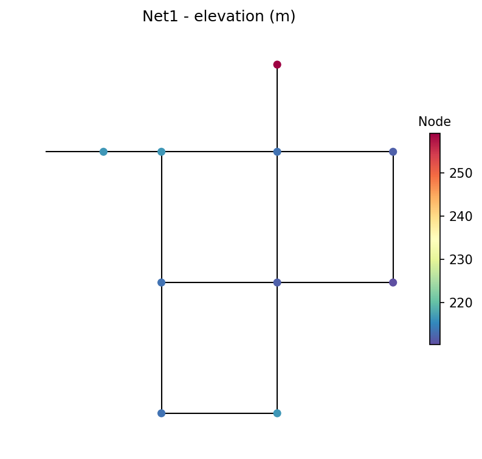
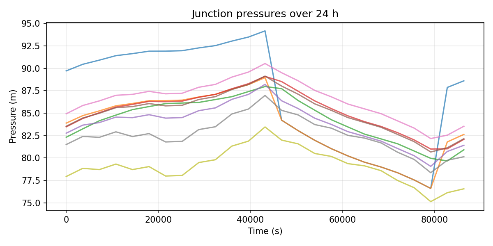
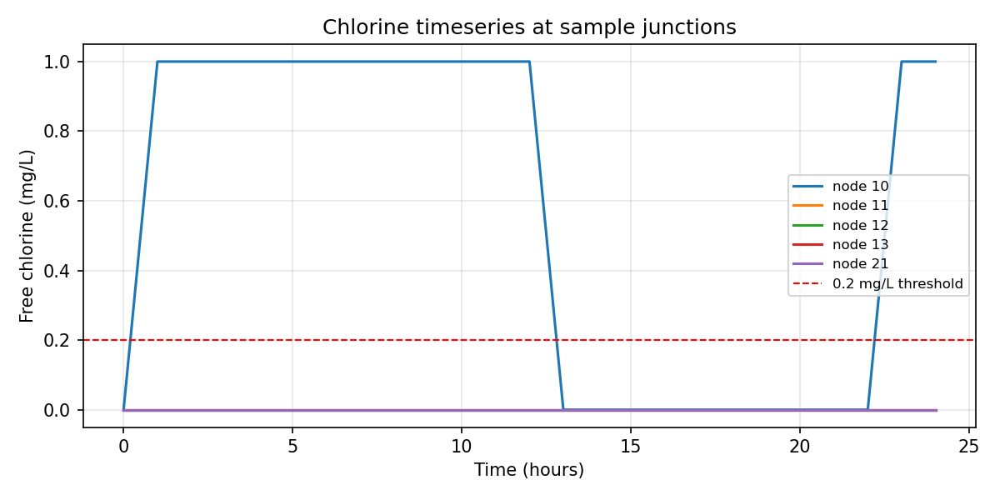
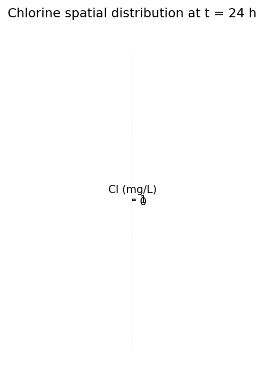

# Week 1 Demo 结果解释

> 配套脚本：[`../../src/01_demo_wntr.py`](../../src/01_demo_wntr.py)
> 配套数据：[`../../models/Net1.inp`](../../models/Net1.inp)、[`../../results/week1_demo/`](../../results/week1_demo/)
> 配套文件：[`../../plan1.md`](../../plan1.md) §2.2 Step 3
> 生成时间：2026-05-17（首次跑通）

---

## 0. TL;DR

| 问题 | 答案 |
| --- | --- |
| 用了什么数据？ | EPANET 自带的 **Net1.inp** 教学网络（1 水源 + 1 泵 + 1 水塔 + 9 节点 + 12 管段） |
| 模拟什么？ | 24 h 水力 + 一阶 bulk decay 余氯传输（k = −0.5/day，wall decay 关） |
| 主要结果？ | 水力合理（无负压）；余氯**只到了 node 10**，其余 8 个节点全程为 0 |
| 是 bug 吗？ | 不是。24 h 太短 + 我故意把 junctions 初始浓度置零，所以看到的是 chlorine 从源头"刚刚启程"的状态 |
| 价值？ | 工具链端到端跑通，下一步把 duration 拉长到 72–168 h 就能看到完整衰减分布 |

---

## 1. 输入数据：Net1.inp

EPANET 官方 Example Network 1，来自 `wntr` 包内 `wntr/library/networks/Net1.inp`，脚本首次运行时自动复制到 `models/Net1.inp`。

**网络组件**：

| 组件 | 数量 | 说明 |
| --- | --- | --- |
| Reservoir（水源） | 1（ID `9`） | 固定水头 800 ft，水流总入口 |
| Pump（泵） | 1（ID `9`） | 标称 1500 GPM @ 250 ft，把水从 reservoir 抽进网络 |
| Tank（水塔） | 1（ID `2`） | 直径 50.5 ft，初始水位 120 ft，控制泵开关 |
| Junction（用水节点） | 9（`10/11/12/13/21/22/23/31/32`） | base demand 100–200 GPM |
| Pipe（管段） | 12 | 长度 200–10530 ft，直径 6–18 in |

**控制逻辑**（[Net1.inp](../../models/Net1.inp) 行 67–69）：

- 水塔水位 < 110 ft → 泵 ON
- 水塔水位 > 140 ft → 泵 OFF

**用水模式**（2h 一步、12 步循环 24 h）：

- 白天峰值 1.6×base
- 夜间低谷 0.4×base

---

## 2. 我在脚本里加的余氯设置

参见 [`01_demo_wntr.py`](../../src/01_demo_wntr.py) `build_model()`（行 143–173）。

| 参数 | 取值 | 含义 |
| --- | --- | --- |
| `duration` | 24 h | 模拟时长 |
| `hydraulic_timestep` | 1 h | 水力解算步长 |
| `quality_timestep` | 5 min | 水质传输步长 |
| `report_timestep` | 1 h | CSV/绘图采样步长 |
| `reaction.bulk_coeff` | **−0.5 /day** | 一阶 bulk decay（水体内自衰减） |
| `reaction.wall_coeff` | 0 | 管壁衰减暂关（简化第一版） |
| `reaction.bulk_order` | 1 | dC/dt = −k·C |
| reservoir 初始 quality | **1.0 mg/L** | 进入网络的水浓度 |
| junctions 初始 quality | **0.0 mg/L**（覆盖 inp 默认的 0.5） | 让我们看到 chlorine 从源头"传"过去的过程 |

> **注**：Net1.inp 原本在 `[QUALITY]` 段把所有 junctions 初始化为 0.5 mg/L，但我在代码里把它们重置为 0。这是有意为之——demo 阶段我们想直观看到 chlorine 的传播，而不是从已经"灌满 chlorine"的稳态开始。下一阶段（Week 3 baseline simulation）会恢复 .inp 的稳态设置。

---

## 3. 四张图逐张解读

### 3.1 网络拓扑



- 图示 11 个节点（9 junctions + 1 reservoir + 1 tank）、12 根管段。
- 节点颜色按 elevation（高程）着色：reservoir 9 在最左、水塔 2 在顶部、用水节点在中间偏下。
- **作用**：确认 wntr 能正确解析 `.inp` 拓扑、坐标。

### 3.2 压力时间序列



- 横轴时间（秒），纵轴压力（m），9 条曲线是 9 个 junction。
- **主要观察**：
  - 全程**没有负压**（脚本也输出 `Negative-pressure samples: 0`），水力模型合理。
  - 曲线在前 12 h 缓慢上升、13 h 时 node 10 突然跌 ~10 m，这是**泵从 ON 切到 OFF 的瞬间**（水塔灌满，触发 control `LINK 9 CLOSED IF NODE 2 ABOVE 140`）。
  - 13–22 h 期间所有节点压力缓慢下降（水塔被消耗）；23 h 重新跳上来 = 泵再次启动。

### 3.3 余氯时间序列



- 横轴时间（小时），纵轴 free chlorine（mg/L），5 条曲线是前 5 个 junction（10/11/12/13/21）。
- 红色虚线 = 0.2 mg/L 工作阈值（README §3 中提及的待确认值）。
- **主要观察**：
  - **node 10**（黑色曲线）：明显的 0→1→0→1 方波。原因——node 10 是泵下游第一个节点，泵 ON 时 1.0 mg/L 的新鲜水进来、泵 OFF 时（13 h）水流停止 chlorine 被"刷走"，泵再 ON（23 h）又恢复。
  - **node 11/12/13/21**：**全程贴在 0 mg/L 这条线上**（与 0.2 阈值线、x 轴几乎重合）。这是真实的——24 h 内 chlorine 还没传播过去。

### 3.4 余氯空间分布（t = 24 h）



- 24 h 末刻的网络余氯快照，节点颜色按 chlorine 浓度。
- **观察**：只有 node 10 是深色（1.0 mg/L），其他 junctions 全部接近 0。
- 印证了时间序列的发现：**chlorine 24 h 内只到了 node 10**。

---

## 4. CSV 数据节选

### 4.1 压力（[`pressure_junctions.csv`](../../results/week1_demo/pressure_junctions.csv)）

25 × 9，关键时刻摘录：

| 时间 | node 10（近泵） | node 22（中心） | node 32（最远） |
| --- | --- | --- | --- |
| 0 h | 89.7 m | 83.5 m | 77.9 m |
| 12 h | 94.2 m | 89.1 m | 83.5 m |
| **13 h** | **84.2 m** ← 突降 | 88.0 m | 82.0 m |
| 23 h | 88.6 m | 82.2 m | 76.6 m |

### 4.2 余氯（[`chlorine_junctions.csv`](../../results/week1_demo/chlorine_junctions.csv)）

25 × 9，完整数据只有两种值：

| 时间窗口 | node 10 | node 11/12/13/21/22/23/31/32 |
| --- | --- | --- |
| 0 h（初始） | 0.0 | 0.0 |
| 1–12 h（泵 ON 阶段） | **1.0** | 0.0 |
| 13–22 h（泵 OFF 阶段） | 0.0 | 0.0 |
| 23–24 h（泵再 ON） | **1.0** | 0.0 |

---

## 5. 关键解读：为什么 chlorine 几乎传不出去？

不是 bug，而是**物理 + 模型设置**的合理结果。三个原因：

### 原因 ① 我把 junctions 的初始 chlorine 强制设为 0

EPANET 把 chlorine 当作沿水流 advect 的示踪剂。`node 11` 想"收到" chlorine，必须等带 chlorine 的水真的经 pipe 10 流过去。如果保留 .inp 默认的 0.5 mg/L 初始浓度，所有节点一开始就有 chlorine——但那样就**看不到传播过程**。

### 原因 ② Net1 管段尺度大 + demand 抑制流速

粗算 pipe 10（长 10530 ft ≈ 3210 m、直径 18 in ≈ 0.457 m）：
- 截面积 A ≈ π(0.457)²/4 ≈ 0.164 m²
- 容积 V ≈ A × L ≈ 526 m³

即使泵全开标称流量 1500 GPM ≈ 0.095 m³/s，把整根管"洗"一遍要 5500 s ≈ 1.5 h。但 pipe 10 出口分两路（去 node 11 + 去水塔 pipe 110），加上 demand pattern 夜间只有 0.4×base，**实际下游流速远低于这个估算**。

### 原因 ③ 泵 duty cycle 让 chlorine 进入是间歇性的

13–22 h 这 10 个小时泵关着，没有新鲜 chlorine 注入，node 10 自身的水还慢慢下游，结果就是 24 h 这个窗口内 chlorine 基本只在 node 10 一个节点"打转"。

---

## 6. 这次 demo 的真正价值

**目标 ≠ 给出有意义的校准数据**，而是验证三件事，全部通过：

| 验证项 | 结果 |
| --- | --- |
| 工具链端到端 | ✅ wntr 1.4 + EPANET 引擎装好、能跑、能输出 |
| API 接口理解 | ✅ `bulk_coeff` / `quality.parameter` / `initial_quality` 等关键开关都摸清楚 |
| 结果可解释 | ✅ 看到的 0/1 方波 chlorine **完全可以**用「泵 duty cycle + advection」解释，没有 silent failure |

---

## 7. 对 Week 3 baseline simulation 的启示

| 观察 | 改进方向 |
| --- | --- |
| 24 h 不够 chlorine 充满网络 | duration 扩到 **≥ 72 h**（建议 168 h = 1 周）直到达到准稳态 |
| 用 `initial_quality = 0` 浪费 24 h 信号 | baseline 校准应恢复 .inp 默认值（junctions 0.5 mg/L），从准稳态出发 |
| Net1 太小（9 节点）写论文不够 | Week 3 切到 **Net3**（约 90 节点）或 **BWSN benchmark** |
| chlorine 0/1 方波是 advection + 离散 timestep 边界效应 | 选更细的 quality_timestep（如 1 min）做对照 |
| wall decay 暂时为 0 | baseline 加上 wall_coeff（典型 −1/day），对照 bulk-only vs bulk+wall |

---

## 8. 复现命令

```bash
cd "/Users/prx/Desktop/帝国理工/毕设/codes"
conda activate cive70058
python src/01_demo_wntr.py
```

产物：
- `figures/week1_demo/01_network.png` ~ `04_chlorine_spatial.png`
- `results/week1_demo/chlorine_junctions.csv`、`pressure_junctions.csv`
- `models/Net1.inp`（首次运行自动从 wntr 包复制）
