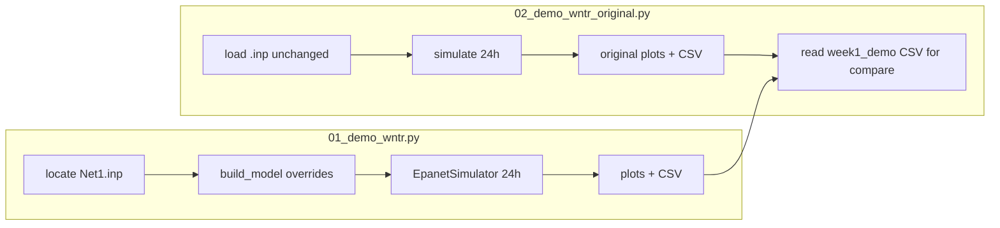

# Week 1 Demo — Results Interpretation

> **Scripts**
> - Modified demo (Demo 1): [`../src/01_demo_wntr.py`](../src/01_demo_wntr.py) → `results/week1_demo/`
> - Original baseline (Demo 2): [`../src/02_demo_wntr_original.py`](../src/02_demo_wntr_original.py) → `results/week1_original/`
> - Comparison outputs: same script, Step (d) → `results/week1_compare/`
>
> **Input model**: [`../models/Net1.inp`](../models/Net1.inp)  
> **Plan reference**: [`../plan1.md`](../plan1.md) §2.2 Step 3  
> **Last updated**: 2026-05-20 (Python walkthrough at top; 2026-05-19 original .inp comparison + mg/L fix)  
> **中文版**: [`结果解释.md`](结果解释.md)

---

## Python Code Walkthrough

> Understand what each script does and where outputs land **before** reading Parts A–C.  
> Environment: `conda activate cive70058`, run from the repository root.

### Run order (required)

```bash
# Step 1: modified demo (must run first — script 02 reads its CSV)
python src/01_demo_wntr.py

# Step 2: original baseline + side-by-side comparison
python src/02_demo_wntr_original.py
```



---

### Script 1: `01_demo_wntr.py` (modified demo)

| Block | Function / location | What it does | Output / side effect |
| --- | --- | --- | --- |
| **Env** | Top of file | Set `MPLCONFIGDIR` (matplotlib cache); silence `pkg_resources` deprecation | No files |
| **Paths** | `REPO_ROOT`, `OUT_DIR` | Create `results/week1_demo/`, `models/` | Directories |
| **① Model** | `locate_net1_inp()` | Prefer `models/Net1.inp`; else copy from wntr package (1.3 / 1.4 paths) | `models/Net1.inp` |
| **② Params** | `build_model()` | Load `.inp` then **override** quality & time (see table below) | In-memory `WaterNetworkModel` |
| **③ Sim** | `main()` → `EpanetSimulator.run_sim()` | EPANET 24 h **hydraulics + chlorine**; writes temp `temp.inp` at repo root (gitignored) | `SimulationResults` |
| **④ Units** | `KGM3_TO_MGL = 1000` | WNTR returns **kg/m³**; ×1000 → **mg/L** for plots/CSV | — |
| **⑤ Checks** | `main()` prints | Count junction **negative pressure** samples; print Cl min/max | Terminal `[check]` lines |
| **⑥ Plots** | `plot_network` … `plot_chlorine_spatial` | 4 PNGs (topology, pressure, Cl timeseries, Cl spatial) | See output table |
| **⑦ CSV** | `chlorine.to_csv` / `pressure.to_csv` | 25 rows × 9 cols (0–24 h, 9 junctions) | 2 CSV files |

**Changes in `build_model()` vs the raw `.inp`** (core Demo 1 vs original difference):

| Item | Demo 1 | Original `.inp` |
| --- | --- | --- |
| Duration / steps | 24 h; hydraulics 1 h; quality 5 min; report 1 h | Same (`.inp` defaults) |
| Quality type | `CHEMICAL` / Chlorine | Same |
| Bulk decay | −0.5 /day | −0.5 /day |
| **Wall decay** | **0 (off)** | **≈ −0.3048 m/day** (`.inp` lists −1 US) |
| Reservoir initial Cl | **0.001 kg/m³ = 1.0 mg/L** (via API) | 1.0 mg/L |
| **Junction initial Cl** | **0.0 mg/L** | **0.5 mg/L** |

**Typical terminal output** (modified demo):

```
[setup] Using model: .../models/Net1.inp
[setup] Junctions: 9 | Pipes: 12 | ...
[run]   Starting EPANET simulation ...
[run]   Simulation finished.
[check] Negative-pressure samples at junctions: 0
[check] Chlorine range (mg/L): min=0.000, max=1.000
[out]   Outputs written to .../results/week1_demo
```

---

### Script 2: `02_demo_wntr_original.py` (original + comparison)

| Block | Function / location | What it does | Output / side effect |
| --- | --- | --- | --- |
| **Paths** | `OUT_ORIG`, `OUT_CMP` | Create `results/week1_original/`, `results/week1_compare/` | Directories |
| **① Model** | `locate_net1_inp()` | Same as script 1 | Reuses `models/Net1.inp` |
| **② Load** | `run_original()` | **No `build_model`** — keep all bulk/wall/initial values from `.inp` | Prints bulk/wall/initial Cl for verification |
| **③ Sim** | `EpanetSimulator.run_sim()` | Same 24 h hydraulics + chlorine | `pressure`, `chlorine` DataFrames |
| **④ Original outputs** | `plot_original_outputs()` | Same 4 plots + 2 CSVs as Demo 1; Cl plot shows **all 9 nodes** | `results/week1_original/` |
| **⑤ Read Demo 1** | `make_comparison()` | Read `results/week1_demo/chlorine_junctions.csv` (**run 01 first**) | — |
| **⑥ Compare plots** | `make_comparison()` | Side-by-side timeseries; 24 h spatial snapshot (shared colour scale) | 2 PNGs in `results/week1_compare/` |
| **⑦ Compare tables** | `make_comparison()` | Per-node mean/min/max, share below 0.2 mg/L; network summary | 2 CSVs + terminal print |

**Typical terminal output** (comparison section):

```
[cmp]   Overall network summary:
           mean    min  max  below_0.2_pct
original  0.544  0.153  1.0          4.000
modified  0.062  0.000  1.0         93.778
```

---

### Output inventory (script → files)

| Script | Output under `results/` |
| --- | --- |
| **01** | `week1_demo/`: 4 PNGs + `chlorine_junctions.csv`, `pressure_junctions.csv` |
| **02** | `week1_original/`: 4 PNGs + 2 CSVs; `week1_compare/`: 2 PNGs + `summary_per_node.csv`, `summary_overall.csv` |

**CSV shape** (same for both hydraulic/chlorine tables):

- Rows: 25 (t = 0, 3600, …, 86400 s → 0–24 h, 1 h reporting step)
- Columns: 9 junction IDs (`10`, `11`, …, `32`)
- Chlorine units: **mg/L** (converted in script)
- Pressure units: **m**
- Pressure plot x-axis: **hours** (CSV index still in seconds)

---

### Two pitfalls when reading the code

1. **`initial_quality` units**: Python API uses **kg/m³**. Values in `.inp` as mg/L are converted on load. In Demo 1, reservoir must be set to `0.001` for 1 mg/L.
2. **Demo 1 is not the “official Net1 baseline”**: wall off + zero junction initial values are for toolchain debugging. **Use script 2 / original `.inp` for thesis and calibration** (see Part C).

---

## 0. TL;DR

| Question | Answer |
| --- | --- |
| What data? | EPANET built-in **Net1.inp** (1 source + 1 pump + 1 tank + 9 junctions + 12 pipes) |
| How many configs? | **Two**: ① modified Demo 1 (simplified); ② original `.inp` (no quality overrides) |
| Main difference? | Demo 1 sets junction initial Cl **0.5→0** and **turns off wall decay**; original keeps all `.inp` settings |
| 24 h chlorine (all 9 junctions) | **Original**: mean 0.54 mg/L, min 0.15 mg/L, **4.0%** of samples below 0.2; **Modified**: mean 0.06 mg/L, **93.8%** below 0.2 |
| A bug? | No. Differences come from **intentional simplifications** + physics (advection, decay, pump duty cycle); a past `initial_quality` unit mistake was fixed (see §2.4) |
| Value? | Toolchain verified; “cost of simplification” quantified; Week 3 baseline should use **original `.inp` config** |

---

## 1. Input: Net1.inp

EPANET official Example Network 1 (*modeling chlorine decay, both bulk and wall reactions*), shipped with `wntr`; copied to `models/Net1.inp` on first run.

**Network components**:

| Component | Count | Notes |
| --- | --- | --- |
| Reservoir | 1 (`9`) | Fixed head 800 ft, system inlet |
| Pump | 1 (`9`) | 1500 GPM @ 250 ft, lifts to node 10 |
| Tank | 1 (`2`) | Diameter 50.5 ft, initial level 120 ft, controls pump |
| Junction | 9 (`10`–`32`) | Demands 100–200 GPM |
| Pipe | 12 | Longest pipe 10 ≈ 10530 ft (≈ 3.2 km) |

**Controls** ([Net1.inp](../models/Net1.inp) `[CONTROLS]`):

- Tank level < 110 ft → pump ON  
- Tank level > 140 ft → pump OFF  

**Built-in chlorine settings** (`[QUALITY]` + `[REACTIONS]` — original run uses these unchanged):

| Parameter | `.inp` value | Meaning |
| --- | --- | --- |
| All junction initial values | **0.5 mg/L** | Background chlorine in the network |
| Reservoir `9`, tank `2` | **1.0 mg/L** | High concentration at source/tank |
| `Global Bulk` | **−0.5 /day** | First-order bulk decay |
| `Global Wall` | **−1** US units → WNTR ≈ **−0.3048 m/day** | Wall decay on |
| `Duration` | 24 h | Same as Demo 1 |

---

## 2. Two configurations compared

| Item | **Original `.inp`** (`02_demo_wntr_original.py`) | **Modified Demo 1** (`01_demo_wntr.py`) |
| --- | --- | --- |
| Script behaviour | Load `.inp` with **zero overrides** | `build_model()` overrides several fields |
| Junction initial Cl | **0.5 mg/L** (`.inp` default) | **0.0 mg/L** (forced in code) |
| Reservoir initial Cl | **1.0 mg/L** (`.inp`) | **1.0 mg/L** (code sets `0.001` kg/m³) |
| Bulk decay | −0.5 /day | −0.5 /day (same) |
| Wall decay | **On** (≈ −0.3048 m/day) | **0** (off) |
| Design intent | EPANET official chlorine-decay tutorial case | Toolchain debug: watch advection from source |

### 2.4 Units (important)

In the WNTR Python API, `node.initial_quality` is **SI: kg/m³**.

- `.inp` value `1.0` → loaded as 1 mg/L (WNTR converts automatically).
- In code, write `0.001` for 1 mg/L; writing `1.0` would mean **1000 mg/L**.
- Simulation output `results.node["quality"]` is also kg/m³; multiply by **1000** before plotting/CSV (both scripts do this).

**Same physical concentration throughout** — only the numeric representation changes between `.inp` (mg/L), WNTR memory (kg/m³), and display (mg/L).

---

# Part A — Modified Demo 1 (`01_demo_wntr.py`)

> Output: `results/week1_demo/`

## A.1 Four figures

### A.1.1 Network topology


- 11 nodes, 12 pipes; colour = elevation.  
- Confirms wntr parses `.inp` topology and coordinates.

### A.1.2 Pressure time series


- **No negative pressure** anywhere (`Negative-pressure samples: 0`).  
- Around **13 h**, node 10 drops ~10 m: pump OFF (tank > 140 ft).  
- **23 h** recovery: pump ON again.  
- **Identical to original run** (hydraulics unchanged between scripts).

### A.1.3 Chlorine time series


- Red dashed line = **0.2 mg/L** working threshold (WHO / project README).  
- **Node 10** (first junction after pump): 0 → 1 → 0 → 1 square wave — 1 mg/L when pump ON; zero during OFF (13–22 h); reinjection at 23 h.  
- **Nodes 11/12/13/21 etc.**: stay **≈ 0** for 24 h — chlorine has not advected downstream.

### A.1.4 Spatial chlorine (t = 24 h)


- Only **node 10** is dark (1.0 mg/L); all other junctions near zero.  
- Matches timeseries: in the modified run, chlorine is largely “trapped” at the first pipe segment after 24 h.

## A.2 CSV snapshot (modified)

Source: [`chlorine_junctions.csv`](week1_demo/chlorine_junctions.csv)

| Time window | node 10 | nodes 11–32 (other 8) |
| --- | --- | --- |
| 0 h | 0.0 | 0.0 |
| 1–12 h (pump ON) | **1.0** | 0.0 |
| 13–22 h (pump OFF) | 0.0 | 0.0 |
| 23–24 h (pump ON again) | **1.0** | 0.0 |

## A.3 Why doesn’t chlorine spread in the modified run?

Three overlapping reasons (**not a bug**):

1. **Junction initial Cl forced to 0** — to see chlorine enter from the source, not start from a 0.5 mg/L background.  
2. **Long pipes, branching, low night demand** — pipe 10 has large volume; downstream velocity is much lower than nominal pump flow suggests.  
3. **Pump duty cycle** — no fresh chlorine 13–22 h; node 10 itself is flushed down.

Turning **wall decay off** would *raise* concentrations in the modified run; the dominant effect here is **zero initial values + short 24 h window**, not wall decay being disabled.

---

# Part B — Original `.inp` run (`02_demo_wntr_original.py`)

> Output: `results/week1_original/`

## B.1 Same as Demo 1

- **Hydraulics**: topology, demand pattern, pump control, 24 h duration — identical to Demo 1.  
- **Pressure plot**: `week1_original/02_pressure_timeseries.png` essentially overlays Demo 1.

## B.2 Original chlorine time series


**Very different picture from the modified run**:

| Node | 24 h mean (mg/L) | Min | Ever < 0.2 mg/L? |
| --- | --- | --- | --- |
| 10 (near pump) | 0.94 | 0.50 | No |
| 11 | 0.69 | 0.43 | No |
| 12 | 0.70 | 0.44 | No |
| 13 | 0.49 | 0.31 | No |
| 21 | 0.56 | 0.29 | No |
| 22 | 0.51 | 0.26 | No |
| 23 | 0.31 | 0.21 | No |
| 31 | 0.41 | 0.17 | **16%** of times below 0.2 |
| 32 (farthest) | 0.29 | 0.15 | **20%** of times below 0.2 |

**How to read the plot**:

- From **1 h**, node 11 is already ~0.44 mg/L — junctions start at 0.5 + source at 1.0, so the network **already contains chlorine**; no need to wait for advection to “fill” it.  
- During **pump OFF (13–22 h)**, concentrations **gradually decline** (bulk + wall decay), unlike the modified run where everything except node 10 stays at zero.  
- After **23 h pump ON**, node 10 returns to 1.0 and downstream nodes recover.  
- **Terminal nodes 31/32** have the lowest means and occasionally hit the 0.2 mg/L threshold — the behaviour Net1 is designed to illustrate (**decay + low residuals at the far end**).

## B.3 Original spatial distribution (t = 24 h)


- Network-wide **gradient**: high near pump (~1.0), low at far end (node 32 ≈ 0.15 mg/L).  
- Smooth colour transition consistent with bulk + wall decay and demand dilution.

## B.4 CSV snapshot (original)

Source: [`chlorine_junctions.csv`](week1_original/chlorine_junctions.csv)

| Time (h) | node 10 | node 11 | node 32 (farthest) |
| --- | --- | --- | --- |
| 0 | 0.50 | 0.50 | 0.50 |
| 1 | 1.00 | 0.44 | 0.39 |
| 12 | 1.00 | 0.86 | 0.37 |
| 13 (pump OFF starts) | 0.98 | 0.80 | 0.32 |
| 22 | 0.85 | 0.45 | 0.21 |
| 24 | 1.00 | 0.87 | 0.15 |

---

# Part C — Side-by-side comparison (script 02, Step d)

> Output: `results/week1_compare/`

## C.1 Side-by-side time series


| Left: original `.inp` | Right: modified Demo 1 |
| --- | --- |
| All 9 curves show meaningful concentration | Only node 10 square wave; others at 0 |
| Means ~0.5–0.9 mg/L | Except node 10, always 0 |
| Network 4% of samples < 0.2 mg/L | Network **93.8%** < 0.2 mg/L |

## C.2 Spatial snapshot at 24 h


- **Left (original)**: green-to-yellow gradient from source to far end; node 32 near threshold.  
- **Right (modified)**: only node 10 coloured; rest of network “empty”.

## C.3 Summary tables

Sources: [`summary_overall.csv`](week1_compare/summary_overall.csv), [`summary_per_node.csv`](week1_compare/summary_per_node.csv)

### Network-wide (9 nodes × 25 times = 225 sample points)

| Metric | Original `.inp` | Modified Demo 1 | Change |
| --- | --- | --- | --- |
| Mean (mg/L) | **0.544** | 0.062 | ↓ 89% |
| Min (mg/L) | **0.153** | 0.000 | — |
| Max (mg/L) | 1.000 | 1.000 | Same |
| Share below 0.2 mg/L | **4.0%** | 93.8% | ↑ ~23× |

### Per-node mean difference (`abs_diff_mean` = original − modified)

| Node | Orig mean | Mod mean | Diff | Mod share <0.2 |
| --- | --- | --- | --- | --- |
| 10 | 0.94 | 0.56 | 0.38 | 44% |
| 11 | 0.70 | 0.00 | 0.70 | 100% |
| 12 | 0.70 | 0.00 | 0.70 | 100% |
| 13 | 0.49 | 0.00 | 0.49 | 100% |
| 21–23 | 0.31–0.56 | 0.00 | 0.31–0.56 | 100% |
| 31 | 0.41 | 0.00 | 0.41 | 100% (orig 16%) |
| 32 | 0.29 | 0.00 | 0.29 | 100% (orig 20%) |

## C.4 What does each simplification contribute?

| Simplification | Physical effect | Visible in this comparison |
| --- | --- | --- |
| **Junction initial 0.5 → 0** | Downstream must wait for advection; most nodes stay 0 within 24 h | Modified nodes 11–32 at 0 for 100% of times; original ~0.4 mg/L within 1 h |
| **Wall decay off** | Ignores pipe-wall demand → concentrations **biased high** | If only wall were off (keeping 0.5 initial), levels would exceed original; Demo 1 also zeros initials, which dominates |
| **Combined** | Modified run **severely underestimates** residuals and spatial gradients | Mean −89%; compliance metric (<0.2 share) jumps from 4% to 94% |

> **Conclusion**: Week 3 baseline should use **original `.inp` quality settings** (initial 0.5 + bulk + wall). Demo 1 validates the toolchain only — **do not** use it for calibration or threshold analysis.

---

## 7. What Week 1 actually achieved

| Check | Result |
| --- | --- |
| End-to-end toolchain | ✅ wntr 1.4 + EPANET; both scripts reproducible |
| API & units | ✅ `bulk_coeff` / `initial_quality` / kg/m³↔mg/L understood |
| Interpretable results | ✅ Modified square wave = pump duty + zero initials; original gradient = decay + low far-end residuals |
| Quantified simplification cost | ✅ Comparison tables + side-by-side plots ready for thesis / meeting slides |

---

## 8. Implications for Week 3 baseline

| Observation | Next step |
| --- | --- |
| Demo 1 does not represent a realistic chlorine field | Baseline **restore** `.inp`: `junctions=0.5`, `wall≈−0.3 m/day` |
| 24 h too short for modified run | If studying propagation from zero initials, use duration ≥ **72–168 h**; original already shows gradients at 24 h |
| Net1 has only 9 nodes | Main thesis case → **Net3** or **BWSN** |
| Far-end nodes 31/32 hit threshold in original run | Calibration / uncertainty should focus on **low-residual terminal nodes** |
| Compliance stats from original, not Demo 1 | e.g. “4% of samples < 0.2 mg/L”, not Demo 1’s 94% |

---

## 9. Reproduce

```bash
conda activate cive70058
# from repository root:
python src/01_demo_wntr.py
python src/02_demo_wntr_original.py   # requires Demo 1 CSV
```

**Output inventory**:

| Directory | Contents |
| --- | --- |
| `results/week1_demo/` | Demo 1: 4 PNGs + 2 CSVs |
| `results/week1_original/` | Original: 4 PNGs + 2 CSVs |
| `results/week1_compare/` | 2 PNGs + 2 CSVs |
| `results/结果解释.md` | Chinese interpretation (this document’s counterpart) |
| `results/结果解释-en.md` | This document |
