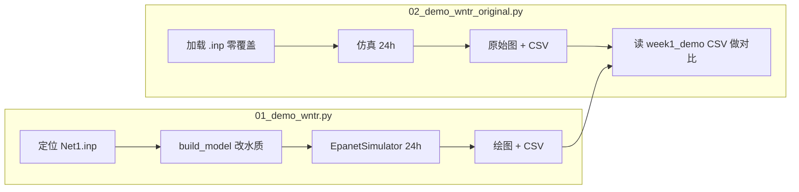
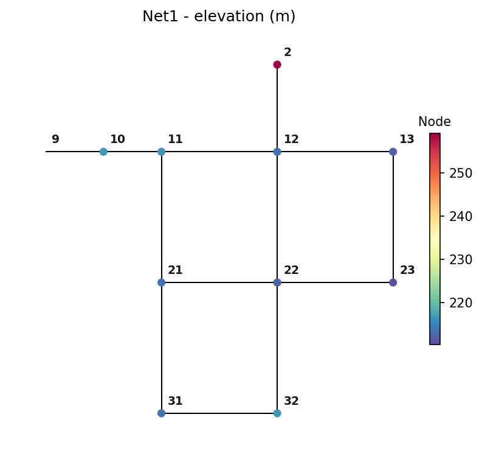
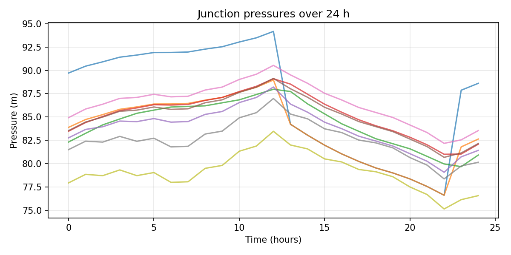
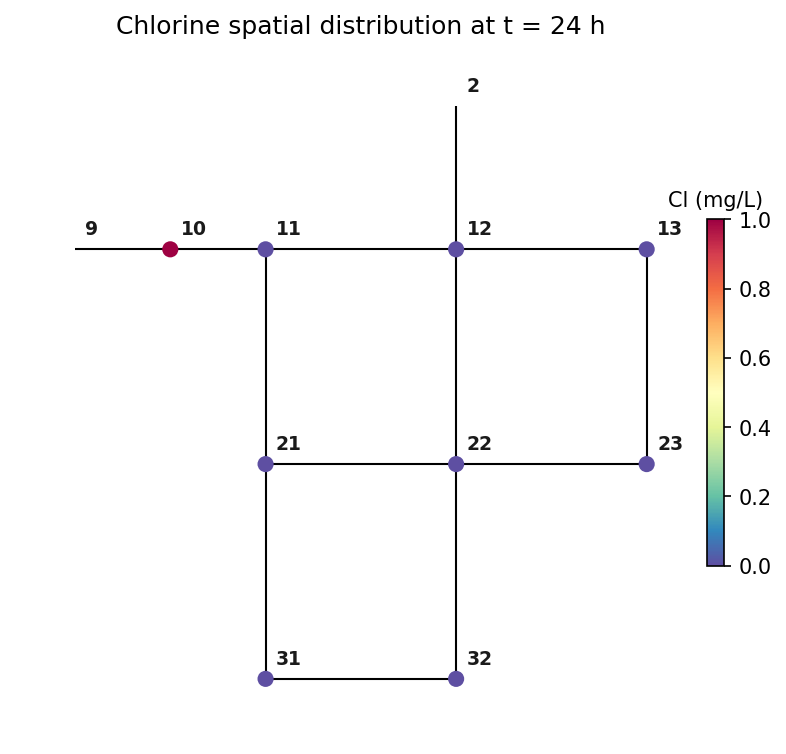
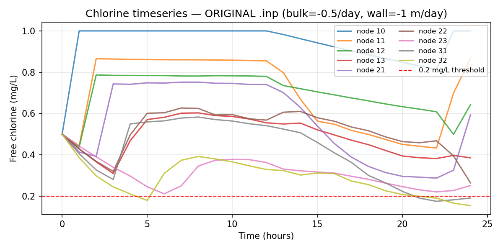
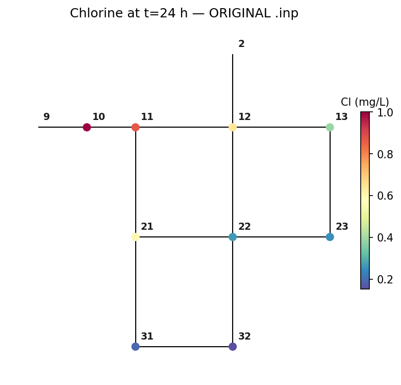
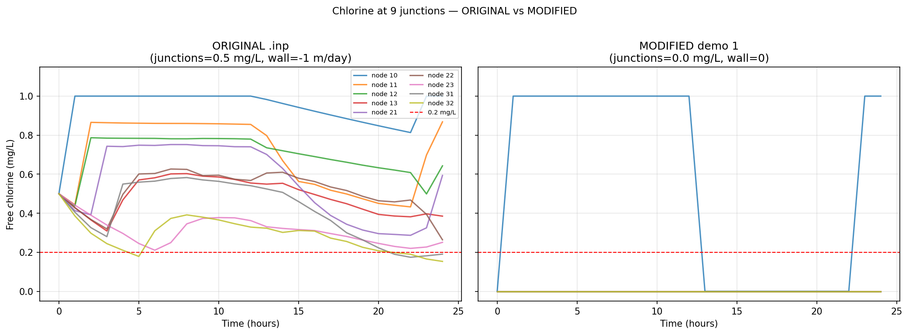
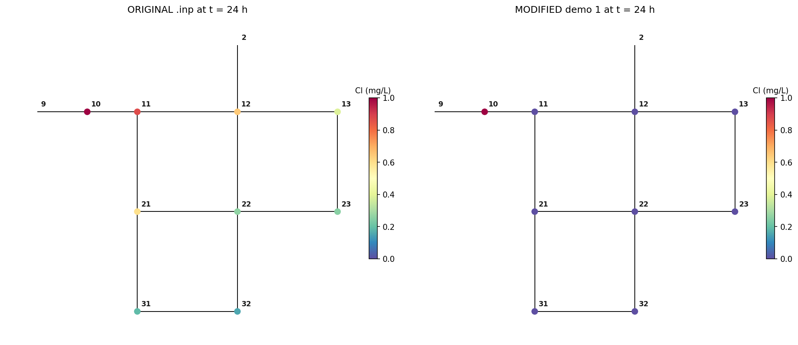

# Week 1 Demo 结果解释

> **配套脚本**
> - 修改版（Demo 1）：[`../src/01_demo_wntr.py`](../src/01_demo_wntr.py) → `results/week1_demo/`
> - 原始版（Demo 2）：[`../src/02_demo_wntr_original.py`](../src/02_demo_wntr_original.py) → `results/week1_original/`
> - 对比汇总：同上脚本 Step (d) → `results/week1_compare/`
>
> **配套数据**：[`../models/Net1.inp`](../models/Net1.inp)  
> **计划依据**：[`../plan1.md`](../plan1.md) §2.2 Step 3  
> **最后更新**：2026-05-20（文首增加 Python 分块讲解；2026-05-19 加入原始 .inp 对比与 mg/L 校正）  
> **English version**: [`结果解释-en.md`](结果解释-en.md)

---

## Python 代码分块讲解

> 先弄清「脚本做了什么、产物在哪」，再读下文 Part A–C 的物理含义。  
> 运行环境：`conda activate cive70058`，在仓库根目录执行。

### 执行顺序（必读）

```bash
# 第一步：修改版 Demo（必须先跑，02 的对比依赖它的 CSV）
python src/01_demo_wntr.py

# 第二步：原始版 + 与 Demo 1 的并排对比
python src/02_demo_wntr_original.py
```



---

### 脚本 1：`01_demo_wntr.py`（修改版 Demo）

| 代码块 | 函数 / 位置 | 做了什么 | 输出 / 副作用 |
| --- | --- | --- | --- |
| **环境** | 文件顶部 | 设置 `MPLCONFIGDIR`（matplotlib 缓存）；屏蔽 `pkg_resources` 弃用警告 | 无文件 |
| **路径** | `REPO_ROOT`, `OUT_DIR` | 定义并创建 `results/week1_demo/`、`models/` | 目录 |
| **① 找模型** | `locate_net1_inp()` | 优先用 `models/Net1.inp`；否则从 wntr 包内复制（兼容 1.3 / 1.4 路径） | `models/Net1.inp` |
| **② 改参数** | `build_model()` | 加载 `.inp` 后**覆盖**水质与时间（见下表） | 内存中的 `WaterNetworkModel` |
| **③ 仿真** | `main()` → `EpanetSimulator.run_sim()` | EPANET 引擎算 24 h **水力 + 余氯**；运行时在仓库根目录写临时 `temp.inp`（已在 `.gitignore`） | `SimulationResults` |
| **④ 单位** | `KGM3_TO_MGL = 1000` | WNTR 返回浓度为 **kg/m³**；×1000 转为 **mg/L** 再绘图/存 CSV | — |
| **⑤ 检查** | `main()` 打印 | 统计 junction **负压** 样本数；打印氯浓度 min/max | 终端 `[check]` 行 |
| **⑥ 绘图** | `plot_network` … `plot_chlorine_spatial` | 4 张 PNG（拓扑、压力、氯时序、氯空间） | 见「产物一览」 |
| **⑦ 存表** | `chlorine.to_csv` / `pressure.to_csv` | 25 行 × 9 列（0–24 h，9 个 junction） | 2 个 CSV |

**`build_model()` 相对 `.inp` 的改动**（Demo 1 与原始版的核心差别）：

| 项 | Demo 1 设置 | 原始 `.inp` |
| --- | --- | --- |
| 时长 / 步长 | 24 h；水力 1 h；水质 5 min；报告 1 h | 同左（`.inp` 默认） |
| 水质类型 | `CHEMICAL` / Chlorine | 同左 |
| bulk decay | −0.5 /day | −0.5 /day |
| **wall decay** | **0（关闭）** | **≈ −0.3048 m/day**（`.inp` 写 −1 US） |
| reservoir 初氯 | **0.001 kg/m³ = 1.0 mg/L**（API 设） | 1.0 mg/L |
| **junction 初氯** | **0.0 mg/L** | **0.5 mg/L** |

**终端典型输出**（修改版）：

```
[setup] Using model: .../models/Net1.inp
[setup] Junctions: 9 | Pipes: 12 | ...
[run]   Starting EPANET simulation ...
[run]   Simulation finished.
[check] Negative-pressure samples at junctions: 0
[check] Chlorine range (mg/L): min=0.000, max=1.000
[out]   Outputs written to .../results/week1_demo
```

---

### 脚本 2：`02_demo_wntr_original.py`（原始版 + 对比）

| 代码块 | 函数 / 位置 | 做了什么 | 输出 / 副作用 |
| --- | --- | --- | --- |
| **路径** | `OUT_ORIG`, `OUT_CMP` | 创建 `results/week1_original/`、`results/week1_compare/` | 目录 |
| **① 找模型** | `locate_net1_inp()` | 与脚本 1 相同 | 复用 `models/Net1.inp` |
| **② 原样加载** | `run_original()` | **不调用 `build_model`**；`.inp` 里 bulk/wall/初值全部保留 | 打印 bulk/wall/初氯供核对 |
| **③ 仿真** | `EpanetSimulator.run_sim()` | 同样 24 h 水力 + 余氯 | `pressure`, `chlorine` DataFrame |
| **④ 原始产物** | `plot_original_outputs()` | 与 Demo 1 **同结构** 4 图 + 2 CSV，但氯图含 **全部 9 节点** | `results/week1_original/` |
| **⑤ 读 Demo 1** | `make_comparison()` | 读取 `results/week1_demo/chlorine_junctions.csv`（**必须先跑 01**） | — |
| **⑥ 对比图** | `make_comparison()` | 左/右并排时序；24 h 空间快照（统一色标） | `results/week1_compare/` 2 PNG |
| **⑦ 对比表** | `make_comparison()` | 每节点 mean/min/max、低于 0.2 mg/L 占比；全网汇总 | `results/week1_compare/` 2 CSV + 终端打印 |

**终端典型输出**（对比段）：

```
[cmp]   Overall network summary:
           mean    min  max  below_0.2_pct
original  0.544  0.153  1.0          4.000
modified  0.062  0.000  1.0         93.778
```

---

### 产物一览（脚本 → 文件）

| 脚本 | 输出目录 `results/` |
| --- | --- |
| **01** | `week1_demo/`：4 PNG + `chlorine_junctions.csv`、`pressure_junctions.csv` |
| **02** | `week1_original/`：4 PNG + 2 CSV；`week1_compare/`：2 PNG + `summary_per_node.csv`、`summary_overall.csv` |

**CSV 形状**（两脚本的水力/氯表相同）：

- 行：25（t = 0, 3600, …, 86400 秒，即 0–24 h，步长 1 h）
- 列：9 个 junction ID（`10`, `11`, …, `32`）
- 氯表单位：**mg/L**（脚本内已换算）
- 压力表单位：**m**

---

### 读代码时的两个坑

1. **`initial_quality` 单位**：Python API 用 **kg/m³**；`.inp` 里写 mg/L 时 WNTR 会自动换算。Demo 1 里 reservoir 必须写 `0.001` 才表示 1 mg/L。
2. **Demo 1 不是「官方 Net1 基准」**：关 wall、junction 初值置 0 是为调试工具链；**写论文 / 校准时以脚本 2 的原始 `.inp` 为准**（见 Part C）。

---

## 0. TL;DR

| 问题 | 答案 |
| --- | --- |
| 用了什么数据？ | EPANET 自带 **Net1.inp**（1 水源 + 1 泵 + 1 水塔 + 9 节点 + 12 管段） |
| 跑了几套配置？ | **两套**：① 修改版 Demo 1（简化）；② 原始 .inp（不覆盖任何水质参数） |
| 两套的主要差别？ | Demo 1 把 junction 初值 **0.5→0**、**关掉 wall decay**；原始版保留 `.inp` 全部设置 |
| 24 h 余氯（全网 9 节点） | **原始**：均值 0.54 mg/L，最低 0.15 mg/L，**4.0%** 时刻低于 0.2；**修改版**：均值 0.06 mg/L，**93.8%** 时刻低于 0.2 |
| 是 bug 吗？ | 不是。两套差异来自**有意简化** + 物理（advection、衰减、泵 duty cycle）；曾有一次 `initial_quality` 单位误设（已修，见 §2.4） |
| 价值？ | 工具链跑通；量化「简化代价」；为 Week 3 baseline 选定 **原始 .inp 配置** |

---

## 1. 输入数据：Net1.inp

EPANET 官方 Example Network 1（标题写明：*modeling chlorine decay, both bulk and wall reactions*），来自 `wntr` 包，脚本首次运行复制到 `models/Net1.inp`。

**网络组件**：

| 组件 | 数量 | 说明 |
| --- | --- | --- |
| Reservoir（水源） | 1（`9`） | 固定水头 800 ft，总入口 |
| Pump（泵） | 1（`9`） | 1500 GPM @ 250 ft，抽水到 node 10 |
| Tank（水塔） | 1（`2`） | 直径 50.5 ft，初始水位 120 ft，控制泵启停 |
| Junction | 9（`10`–`32`） | 需水量 100–200 GPM |
| Pipe | 12 | 最长 pipe 10 ≈ 10530 ft（≈ 3.2 km） |

**控制逻辑**（[Net1.inp](../models/Net1.inp) `[CONTROLS]`）：

- 水塔水位 < 110 ft → 泵 ON  
- 水塔水位 > 140 ft → 泵 OFF  

**`.inp` 内建余氯设置**（`[QUALITY]` + `[REACTIONS]`，原始版完全沿用）：

| 参数 | `.inp` 取值 | 含义 |
| --- | --- | --- |
| 全部 junction 初值 | **0.5 mg/L** | 管网内已有余氯背景 |
| reservoir `9`、tank `2` 初值 | **1.0 mg/L** | 水源/水塔高浓度 |
| `Global Bulk` | **−0.5 /day** | 一阶体相衰减 |
| `Global Wall` | **−1**（US 单位，WNTR 读入后 ≈ **−0.3048 m/day**） | 管壁衰减开启 |
| `Duration` | 24 h | 与 Demo 1 一致 |

---

## 2. 两套配置对照

| 项目 | **原始 .inp**（`02_demo_wntr_original.py`） | **修改版 Demo 1**（`01_demo_wntr.py`） |
| --- | --- | --- |
| 脚本 | 加载 `.inp` 后**零覆盖** | `build_model()` 覆盖多项 |
| junction 初值 | **0.5 mg/L**（`.inp` 默认） | **0.0 mg/L**（代码强制） |
| reservoir 初值 | **1.0 mg/L**（`.inp`） | **1.0 mg/L**（代码设 `0.001` kg/m³） |
| bulk decay | −0.5 /day | −0.5 /day（相同） |
| wall decay | **开启**（≈ −0.3048 m/day） | **0**（关闭） |
| 设计意图 | EPANET 官方氯衰减教学案例 | 工具链调试：看清从源头 advect 的过程 |

### 2.4 单位说明（重要）

WNTR Python API 里 `node.initial_quality` 使用 **SI：kg/m³**。  
- `.inp` 里写 `1.0` → 加载后即为 1 mg/L（WNTR 自动换算）。  
- 代码里应写 `0.001` 表示 1 mg/L；若误写 `1.0` 会变成 **1000 mg/L**。  
- 仿真输出 `results.node["quality"]` 也是 kg/m³，绘图/CSV 前需 **×1000** 转为 mg/L（两脚本均已处理）。

---

# Part A — 修改版 Demo 1（`01_demo_wntr.py`）

> 输出目录：`results/week1_demo/`

## A.1 四张图解读

### A.1.1 网络拓扑



- 11 个节点、12 管段；颜色 = 高程。  
- 确认 wntr 正确解析 `.inp` 拓扑与坐标。

### A.1.2 压力时间序列



- 全程**无负压**（`Negative-pressure samples: 0`）。  
- **13 h** 附近 node 10 压力突降 ≈ 10 m：泵 OFF（水塔 > 140 ft）。  
- **23 h** 回升：泵再次 ON。  
- **与原始版相同**（水力设置未改，两脚本压力曲线一致）。

### A.1.3 余氯时间序列


- 红色虚线 = **0.2 mg/L** 工作阈值（WHO / 项目 README）。  
- **node 10**（泵后首节点）：0 → 1 → 0 → 1 方波——泵 ON 时 1 mg/L 进水，泵 OFF（13–22 h）浓度归零，23 h 再注入。  
- **node 11/12/13/21 等**：24 h 内**全程 ≈ 0**——氯尚未 advect 到下游。

### A.1.4 余氯空间分布（t = 24 h）



- 仅 **node 10** 为深色（1.0 mg/L），其余 junction 接近 0。  
- 与时间表一致：修改版在 24 h 窗口内氯几乎「困在」泵后第一节。

## A.2 CSV 节选（修改版）

来源：[`chlorine_junctions.csv`](week1_demo/chlorine_junctions.csv)

| 时间窗口 | node 10 | node 11–32（其余 8 个） |
| --- | --- | --- |
| 0 h | 0.0 | 0.0 |
| 1–12 h（泵 ON） | **1.0** | 0.0 |
| 13–22 h（泵 OFF） | 0.0 | 0.0 |
| 23–24 h（泵再 ON） | **1.0** | 0.0 |

## A.3 为何修改版「氯传不出去」？

三个叠加原因（**不是 bug**）：

1. **junction 初值强制为 0**——要看到氯从水源「进入」管网，而不是从 0.5 mg/L 背景态出发。  
2. **管段长、分流多、夜间 demand 低**——pipe 10 容积大，实际下游流速远低于泵额定流量估算。  
3. **泵 duty cycle**——13–22 h 无新氯注入，node 10 自身浓度也被冲走。

另外 **wall decay 关闭** 在修改版里会**抬高**浓度；当前「传不出去」主因是 **初值=0 + 24 h 太短**，不是 wall 关掉了。

---

# Part B — 原始 .inp 运行（`02_demo_wntr_original.py`）

> 输出目录：`results/week1_original/`

## B.1 与 Demo 1 相同的部分

- **水力**：拓扑、需求模式、泵控制、24 h 时长——与 Demo 1 完全一致。  
- **压力图**：`week1_original/02_pressure_timeseries.png` 与 Demo 1 实质相同（可叠合对比）。

## B.2 原始版余氯时间序列



**与修改版截然不同的图景**：

| 节点 | 24 h 均值 (mg/L) | 最小值 | 是否曾 < 0.2 mg/L |
| --- | --- | --- | --- |
| 10（近泵） | 0.94 | 0.50 | 否 |
| 11 | 0.69 | 0.43 | 否 |
| 12 | 0.70 | 0.44 | 否 |
| 13 | 0.49 | 0.31 | 否 |
| 21 | 0.56 | 0.29 | 否 |
| 22 | 0.51 | 0.26 | 否 |
| 23 | 0.31 | 0.21 | 否 |
| 31 | 0.41 | 0.17 | **16%** 时刻低于 0.2 |
| 32（最远） | 0.29 | 0.15 | **20%** 时刻低于 0.2 |

**读图要点**：

- **1 h 起** node 11 已达 ~0.44 mg/L——因 junction 初值 0.5 + 水源 1.0，管网**一开始就有氯**，不必等 advection「填满」。  
- **泵 OFF 段（13–22 h）** 全网浓度**缓慢下降**（bulk + wall 衰减），而非修改版那种「除 node 10 外全零」。  
- **23 h 泵再 ON** 后 node 10 回到 1.0，下游随之回升。  
- **末端 node 31/32** 均值最低，且部分时刻触及 0.2 mg/L 阈值——这才是 Net1 官方示例要展示的**衰减 + 末端偏低**行为。

## B.3 原始版空间分布（t = 24 h）



- 全网呈现**梯度**：近泵高（~1.0）、远端低（node 32 ≈ 0.15 mg/L）。  
- 颜色连续变化，符合「bulk + wall decay + 用水稀释」物理图像。

## B.4 CSV 节选（原始版）

来源：[`chlorine_junctions.csv`](week1_original/chlorine_junctions.csv)

| 时间 (h) | node 10 | node 11 | node 32（最远） |
| --- | --- | --- | --- |
| 0 | 0.50 | 0.50 | 0.50 |
| 1 | 1.00 | 0.44 | 0.39 |
| 12 | 1.00 | 0.86 | 0.37 |
| 13（泵 OFF 开始） | 0.98 | 0.80 | 0.32 |
| 22 | 0.85 | 0.45 | 0.21 |
| 24 | 1.00 | 0.87 | 0.15 |

---

# Part C — 双配置对比（`02` 脚本 Step d）

> 输出目录：`results/week1_compare/`

## C.1 并排时间序列



| 左图：原始 .inp | 右图：修改版 Demo 1 |
| --- | --- |
| 9 条曲线均有明显浓度 | 仅 node 10 有方波，其余贴 0 |
| 均值 ~0.5–0.9 mg/L | 除 node 10 外恒为 0 |
| 全网 4% 时刻 < 0.2 mg/L | 全网 **93.8%** 时刻 < 0.2 mg/L |

## C.2 24 h 空间快照对比



- **左（原始）**：由近到远由绿到黄，末端 node 32 已接近阈值。  
- **右（修改）**：仅 node 10 有色，网络其余部分「空白」。

## C.3 数值汇总表

来源：[`summary_overall.csv`](week1_compare/summary_overall.csv)、[`summary_per_node.csv`](week1_compare/summary_per_node.csv)

### 全网（9 节点 × 25 时刻 = 225 个样本点）

| 指标 | 原始 .inp | 修改版 Demo 1 | 相对变化 |
| --- | --- | --- | --- |
| 均值 (mg/L) | **0.544** | 0.062 | ↓ 89% |
| 最小值 (mg/L) | **0.153** | 0.000 | — |
| 最大值 (mg/L) | 1.000 | 1.000 | 相同 |
| 低于 0.2 mg/L 占比 | **4.0%** | 93.8% | ↑ 约 23 倍 |

### 分节点均值差（`abs_diff_mean` = 原始 − 修改）

| 节点 | 原始均值 | 修改均值 | 差值 | 修改版 <0.2 占比 |
| --- | --- | --- | --- | --- |
| 10 | 0.94 | 0.56 | 0.38 | 44% |
| 11 | 0.70 | 0.00 | 0.70 | 100% |
| 12 | 0.70 | 0.00 | 0.70 | 100% |
| 13 | 0.49 | 0.00 | 0.49 | 100% |
| 21–23 | 0.31–0.56 | 0.00 | 0.31–0.56 | 100% |
| 31 | 0.41 | 0.00 | 0.41 | 100%（原始 16%） |
| 32 | 0.29 | 0.00 | 0.29 | 100%（原始 20%） |

## C.4 两个简化各自贡献什么？

| 简化项 | 物理效应 | 在本对比中的体现 |
| --- | --- | --- |
| **junction 初值 0.5 → 0** | 下游节点需等 advection 才能「收到」氯；24 h 内多数节点仍为 0 | 修改版 node 11–32 100% 时刻为 0；原始版 1 h 内即有 ~0.4 mg/L |
| **wall decay 关闭** | 管壁氯耗被忽略，浓度会**偏高** | 若只关 wall、保留初值 0.5，浓度应高于原始；但 Demo 1 **同时**清零初值，主导效应是初值 |
| **合效应** | 修改版严重**低估**管网余氯水平与空间梯度 | 均值降 89%；合规风险指标（<0.2 占比）从 4% 飙到 94% |

> **结论**：Week 3 baseline 应使用 **原始 .inp 水质设置**（初值 0.5 + bulk + wall）。Demo 1 仅用于验证工具链，**不能**作为校准或阈值讨论的数值依据。

---

## 7. 本次 Week 1 的真正价值

| 验证项 | 结果 |
| --- | --- |
| 工具链端到端 | ✅ wntr 1.4 + EPANET；两套脚本均可复现 |
| API 与单位 | ✅ `bulk_coeff` / `initial_quality` / kg/m³↔mg/L 已摸清 |
| 结果可解释 | ✅ 修改版方波 = 泵 duty + 零初值；原始版梯度 = 衰减 + 末端偏低 |
| 简化代价可量化 | ✅ 对比表 + 并排图可直接进 thesis / meeting slides |

---

## 8. 对 Week 3 baseline 的启示

| 观察 | 改进方向 |
| --- | --- |
| Demo 1 不能代表真实余氯场 | baseline **恢复** `.inp`：`junctions=0.5`、`wall≈−0.3 m/day` |
| 24 h 对修改版太短 | 若从零初值研究传播，duration ≥ **72–168 h**；原始版 24 h 已有梯度 |
| Net1 仅 9 节点 | 论文主体换 **Net3** 或 **BWSN** |
| 末端 node 31/32 在原始版已触阈值 | 校准/不确定性分析应关注**远端低氯节点** |
| 合规指标应用原始版统计 | 例如「<0.2 mg/L 占 4%」而非 Demo 1 的 94% |

---

## 9. 复现命令

```bash
cd "/Users/prx/Desktop/帝国理工/毕设/codes"
conda activate cive70058

# 修改版 Demo 1
python src/01_demo_wntr.py

# 原始版 + 对比（依赖 Demo 1 的 CSV）
python src/02_demo_wntr_original.py
```

**产物一览**：

| 目录 | 内容 |
| --- | --- |
| `results/week1_demo/` | Demo 1：4 PNG + 2 CSV |
| `results/week1_original/` | 原始版：4 PNG + 2 CSV |
| `results/week1_compare/` | 2 PNG + 2 CSV |
| `results/结果解释.md` | 本文（Week 1 全套解读，中文） |
| `results/结果解释-en.md` | English version |
